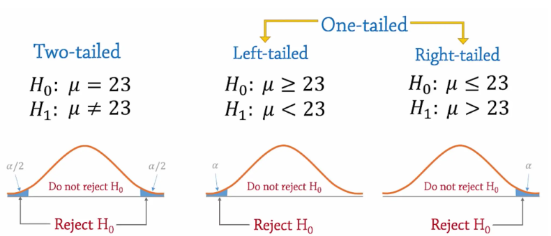

# Intervalos de confianza


**Paquetes necesarios**

```{r include=FALSE}
library(stats)
library(dplyr)
```

## MEDIA


### Intervalos de confianza para la media

Para calcular el intervalo de confianza para la media, se deben conocer tres componentes: la media muestral, el error muestral y el valor de la distribución correspondiente al nivel de confianza asignado para el intervalo.


El intervalo de confianza para estimar la media poblacional $\mu$ se construye de la siguiente manera:


$$
IC_{\mu} = (\bar{X} - Z_{\alpha/2} \cdot  \frac{\sigma}{\sqrt{n}} \leq \mu \leq \bar{X} + Z_{\alpha/2} \cdot  \frac{\sigma}{\sqrt{n}})
$$
Para el caso con distribución t:

$$IC_{\mu} = (\bar{X} - t_{\alpha/2,n-1gdl} \cdot  \frac{s}{\sqrt{n}} \leq \mu \leq \bar{X} + t_{\alpha/2,n-1gdl} \cdot  \frac{s}{\sqrt{n}})$$

Veamos parte por parte cómo hacerlo:


**Calcular la Media muestral**

La media muestral:  $$\bar{X}$$

es el promedio calculado a partir de una muestra aleatoria. En R disponemos de la función `mean` para calcularla facilmente a partir de un conjunto de datos.


**Calcular el Error muestral**


$$ \frac{\sigma}{\sqrt n}$$


$\sigma$ es la desviación estándar poblacional y $n$ es el tamaño
de la muestra.


Cuando la desviación estándar poblacional no es conocida, se utiliza la desviación
estándar muestral ($s$):


$$ \frac{s}{\sqrt n}.$$


**Calcular el Valor Crítico**

Teniendo en cuenta los supuestos, podemos determinar si la media sigue una **distribución Normal (Z)** (datos normales, desviación estándar poblacional conocida y muestra lo suficientemente grande) o **distribución t-student (t)** (datos no normales, desviación estándar poblacional desconocida y muestra pequeña)

También debemos recordar que los intervalos de confianza son aleatorios puesto que se contruyen a partir de una muestra aleatoria, por lo tanto, existe un nivel de confianza $1-\alpha$ y un margen de error conocido $\alpha$ para estimar el parámtero. 

Ese valor $\alpha$ se divide entre 2 para distribuirlo a cada lado del intervalo de confianza.  

Es por esto que, Una vez determinada la distribución apropiada para el caso, se define el valor crítico para $\alpha/2$: 

- $Z_{\alpha/2}$ para el caso Normal
- $t_{\alpha/2}$ para el caso t-student

***Ya conocemos también las funciones `d, p, q, r` que nos permitían realizar operaciones a partir de las distribuciones de probabilidad*** 

+ **d**: Calcula la funcion de densidad de probabilidad (PDF) o la funcion de masa de probabilidad (PMF) para una distribucion.  
+ **p**: Calcula la funcion de distribucion acumulada (CDF), que nos dice la probabilidad de obtener un valor menor o igual a un punto dado.  
+ **q**: Calcula cuantiles o percentiles de la distribucion.  
+ **r**: Genera valores aleatorios a partir de la distribucion especificada.  

Para calcular el valor crítico utilizaremos la función `q`, que calcula el valor de Z o de t a partir de una probabilidad dada:

***Para el caso $1-\alpha = 95%$, con $\alpha = 5\% = 0.05$:***  

Distribución normal:
```{r}

qnorm(0.025, lower.tail = FALSE)

```

Distribución t con 9 grados de libertad (ejemplo):
```{r}

qt(0.025, df=9, lower.tail = FALSE) #df = Grados de libertad

```

::: note
Nota: el parámetro ´lower.tail = FALSE´ se utiliza para que el valor crítico sea el de la derecha (positivo). Ya sabemos que estas dos distribuciones son siméticas y el valor es el mismo para cada lado del intervalo_
:::


**Calcular el Intervalo de Confianza**

Entonces, para calcular el intervalo de confianza se debe tener la estructura:

límite inferior (izquierda) del intervalo de confianza:

```r
limite_inf = media muestral - qdistribucion(valor correspondiente) * error_muestral
```

Para el límite superior (derecha) del intervalo de confianza:

```r
limite_sup = media muestral + qdistribucion(valor correspondiente) * error_muestral
```

### Ejemplo (teórico) intervalo de confianza para media poblacional:

Un grupo de investigadores quiere estimar el tiempo promedio que los ciudadanos de un país dedican diariamente a informarse con los noticieros. Se toma una muestra aleatoria de 1,500 personas, obteniendo una media muestral de 45 minutos diarios. Estudios previos indican que la desviación estándar poblacional es de 20 minutos. Calcular un intervalo de confianza del 95% para el tiempo promedio que la población dedica a informarse a través de noticieros.

Primero, organizar los datos y guardarlos en objetos con los nombres que consideremos adecuados:

```{r}

# Datos
x_barra <- 45       # media muestral
desv_est <- 20       # desviación estándar poblacional
n <- 1500         # tamaño de muestra
alpha <- 0.05

```

Teniendo en cuenta el ejercicio, la media sigue en este caso una distribución Normal, ya que se trata de un amuestra grande y la desviación estándar poblacional es conocida.
Ahora se debe determinar el valor crítico $Z_{\alpha/2}$

```{r}
# Valor crítico Z

z_alpha_2 <- qnorm(0.025, lower.tail = FALSE) #El valor de Z para alpha/2
z_alpha_2

```

Calcular el error, en este caso: $ \frac{\sigma}{\sqrt n}$

```{r}

# Error:
error <- desv_est / sqrt(n) #sqrt calcula la raiz
#Tenga en cuenta que cada dato proporcionado por el ejercicio ya lo habíamos guardado con nombres apropiados.


error

```

Construir el ntervalo de confianza:

```{r}

# Intervalo de confianza
ic_izquierda <- x_barra - z_alpha_2 * error
ic_derecha <- x_barra + z_alpha_2 * error

c(ic_izquierda, ic_derecha) #Esto permite concatenar los dos números para que se muestren juntos

```

**Respuesta:** Con un 95% de confianza, el tiempo promedio que los ciudadanos dedican a informarse sobre política está entre 43.99 y 46.01 minutos


---


### Prueba de hipótesis para la media

Recordemos que:

Una prueba de hipótesis es un procedimiento estadístico utilizado para tomar decisiones sobre un parámetro poblacional basándose en una muestra. Matemáticamente, se trata de evaluar la validez de una afirmación acerca de una población utilizando teoría de probabilidades y distribuciones muestrales

***El objetivo de una prueba de hipótesis es evaluar si los datos de una muestra proporcionan evidencia estadísticamente significativa para rechazar una hipótesis sobre la media poblacional***

- **Hipótesis nula $H_0$** La hipótesis que se debe comprobar. Inicialmente se asume como verdadera.

- **Hipótesis alternativa $H_1$** Se establece como el “complemento” de $H_0$  
  - Prueba bilateral: \( H_1: \mu \neq \mu_0 \)
  - Prueba unilateral derecha: \( H_1: \mu > \mu_0 \)
  - Prueba unilateral izquierda: \( H_A: \mu < \mu_0 \)


**Seleccionar el estadístico de prueba**


***Caso 1: Desviación estándar poblacional **conocida** (prueba Z)***

$$
Z = \frac{\bar{X} - \mu}{\sigma / \sqrt{n}}
$$

***Caso 2: Desviación estándar poblacional **desconocida** (prueba t de Student)***

$$
T = \frac{\bar{X} - \mu}{S / \sqrt{n}}, \quad T \sim t_{n-1}
$$


**Calcular el Valor o valores Críticos:**

***Volvemos a utilizar las funcionas `d, p, q, r` para las distribuciones de probabilidad*** 

Nuevamente, teniendo en cuenta los supuestos, podemos determinar si la media sigue una **distribución Normal (Z)** (datos normales, desviación estándar poblacional conocida y muestra lo suficientemente grande) o **distribución t-student (t)** (datos no normales, desviación estándar poblacional desconocida y muestra pequeña)

También debemos recordar que las pruebas de hipótesis tienen un nivel de significancia $\alpha$.

Una vez determinada la distribución apropiada para el caso,y el tipo de prueba ***(bilateral o unilateral)*** se define el valor crítico para $\alpha$ o $\alpha/2$. 





***Caso bilateral con $\alpha = 5\%$***

 \( H_1: \mu \neq \mu_0 \)  
 
En este caso el valor $\alpha$ se divide entre 2 para encontrar los valores críticos de cada lado. Es decir, existen dos valores críticos.

- Ejemplo: Caso con distribución Normal $Z_{\alpha/2}$ (bilateral)

```{r}
qnorm(0.025) #Valor crítico por la izquierda
```

```{r}
qnorm(0.025, lower.tail = FALSE) #Valor crítico por la derecha
```

- Ejemplo: Caso con distribución t con 9 grados de libertad $t_{\alpha/2,n-1 gdl}$ (bilateral)

```{r}
#Valor crítico por la izquierda
qt(0.025, df=9) #df = Grados de libertad
```
```{r}
#Valor crítico por la derecha
qt(0.025, df=9, lower.tail = FALSE) #df = Grados de libertad
```

***Caso Unilateral cola derecha con $\alpha = 5\%$***

 \( H_1: \mu > \mu_0 \) 
 
En este caso el valor $\alpha$ NO divide entre 2. Es decir, sólo se tiene un valor crítico por la derecha.

- Ejemplo: Caso con distribución Normal $Z_{\alpha}$ (Unilateral derecha)

```{r}
qnorm(0.05, lower.tail = FALSE) #Valor crítico por la derecha
```
- Ejemplo: Caso con distribución t con 9 grados de libertal $t_{\alpha,n-1 gdl}$ (Unilateral derecha)

```{r}
qt(0.05, df= 9, lower.tail = FALSE) #Valor crítico por la derecha
```
 
***Caso Unilateral cola izquierda con $\alpha = 5\%$***

 \( H_1: \mu < \mu_0 \) 
 
En este caso el valor $\alpha$ NO divide entre 2. Es decir, sólo se tiene un valor crítico por la izquierda.

- Ejemplo: Caso con distribución Normal $Z_{\alpha}$ (Unilateral izquierda)

```{r}
qnorm(0.05) #Valor crítico por la izquierda
```
- Ejemplo: Caso con distribución t con 9 grados de libertal $t_{\alpha,n-1 gdl}$ (Unilateral izquierda)

```{r}
qt(0.05, df= 9) #Valor crítico por la derecha
```

**Calcular el p valor**

El p-valor es la probabilidad, bajo la suposición de que la hipótesis nula $H_0$ es cierta, de obtener un valor de la estadística de prueba tan extremo o más extremo que el observado.

En otras palabras, mide qué tan probable es el resultado muestral si $H_0$ fuera verdadera.

***Aquí el comando utilizado es ´p´ para calcular la probabilidad:***


- P valor para una prueba bilateral (se multiplica por 2 al ser de dos colas):

```r
pvalor_z <- 2 * pnorm(abs(z), lower.tail = FALSE)        # si se usa distribución Z

pvalor_t <- 2 * pt(abs(T), df= n-1 gdl, lower.tail = FALSE)       # si se usa t de Student
```


- P valor Para una prueba Unilateral derecha:

```r
pvalor_z <- pnorm(z, lower.tail = FALSE)

pvalor_t <- 1 - pt(T, df = n-1 gdl, lower.tail = FALSE)

```


- P valor Para una prueba Unilateral izquierda:

```r
pvalor_z <- pnorm(Z)

pvalor_t <- 1 - pt(T, df = n-1 gdl)

```

::: note
Recuerde que lower.tail = FALSE es para que calcule la probabilidad acumulada por la derecha_
:::

**Tomar la decisión**


- **Usando valor crítico**:
  - Se rechaza \( H_0 \) si el estadístico de prueba cae fuera del intervalo definido por el o los valores críticos.
  
- **Usando p-valor**:
  - Se rechaza \( H_0 \) si \( p \leq \alpha \).


### Ejemplo (teórico) prueba de hipótesis para media poblacional:

La pobreza puede influir en el desarrollo del lenguaje en la infancia debido a factores como el acceso limitado a recursos educativos y la menor exposición a vocabulario variado en el hogar. Se estima que, en el país la población general de niños de 5 años, el tamaño promedio del vocabulario es de 2,000 palabras, con una desviación estándar de 300 palabras. Sin embargo, no se sabe con certeza si este valor se mantiene en niños que crecen en contextos de pobreza. 
Para investigar esto, un grupo de psicólogos selecciona una muestra de 180 niños en situación de pobreza y encuentra que su vocabulario promedio es de 1,950 palabras. ¿El tamaño del vocabulario en niños de 5 años en pobreza del país es realmente 2,000 palabras, o hay evidencia de que es diferente? Tenga en cuenta una significancia del 5%.

Plantear las hipótesis:

$$
\begin{aligned}
H_0\!:\! & \quad \mu = 2000 \quad \text{(el tamaño promedio del vocabulario es 2000 palabras)} \\
H_A\!:\! & \quad \mu \neq 2000 \quad \text{(el tamaño promedio del vocabulario es diferente de 2000 palabras)}
\end{aligned}
$$


Organizar los datos porporcionados:

```{r}
# Datos
x_bar <- 1950         # media muestral
u <- 2000          # valor de la hipótesis nula
sigma <- 300          # desviación estándar poblacional
n <- 180              # tamaño de la muestra
alpha <- 0.05         # nivel de significancia

```


Calcular el estadístico de prueba:
Al tratarse de una muestra grande con desviación estándar poblacional conocida, se utilizará Z.

```{r}
Z <- (x_bar - u) / (sigma / sqrt(n))
Z
```

Calcular valores críticos. Al se runa prueba bilateral, alpha se divide entre 2 (Son dos valores críticos)

```{r}
# Valor crítico para prueba bilateral
z_izquierda <- qnorm(alpha / 2)
z_izquierda
```
```{r}
# Valor crítico para prueba bilateral
z_derecha <- qnorm(alpha / 2, lower.tail=FALSE)
z_derecha
```
Calcular p valor

```{r}
# Valor crítico para prueba bilateral
z_izquierda <- qnorm(alpha / 2)
z_izquierda
```


```{r}
# p-valor
p_valor <- 2 * pnorm(abs(Z), lower.tail = FALSE)
p_valor
```
Decisión:

- Como Z = -2.23, cae en la región crítica, (menor a -1.96), se rechaza $H_0$
 
- El p-valor será aproximadamente 0.025, este valor es menor que $\alpha= 0.05$, se rechaza $H_0$ (esta es otra manera de decidir)


***Respuesta:*** Hay suficiente evidencia estadística para afirmar que el tamaño promedio del vocabulario en niños de 5 años en situación de pobreza es significativamente diferente de 2,000 palabras. 


::: note
Esta manera de calcular intervalo de confianza y prueba de hipóteis es manual, utilizando la fórmula y Rstudio como calculadora. A continuación verás como se utiliza Rstudio para este tipo de análisis
:::


## Caso aplicado: Media

**¿El programa de becas de transporte garantiza condiciones académicas justas?**

En muchas universidades públicas, los estudiantes de estratos socioeconómicos bajos reciben una **beca de transporte** con el objetivo de reducir barreras de acceso y permanencia.

La universidad desea evaluar si, **en promedio**, los estudiantes beneficiarios del programa mantienen un rendimiento académico acorde con el estándar institucional.

El reglamento académico establece que un rendimiento promedio **adecuado** corresponde a una **nota de 3.5** (en una escala de 0 a 5).

---

**Pregunta de investigación**

¿El promedio poblacional de los estudiantes beneficiarios del programa de transporte es **distinto de 3.5**?

---

**Parámetro de interés**

Sea  
\[\mu\]
la media poblacional de la nota de los estudiantes beneficiarios del programa de transporte.

---

**Formulación de hipótesis**

\[
H_0: \mu = 3.5
\]

\[
H_1: \mu \neq 3.5
\]

Se plantea una **prueba bilateral**, ya que no se asume a priori si el rendimiento es mayor o menor que el estándar.

---

**Nivel de significancia**

\[
\alpha = 0.05
\]

---

**Base de datos**

Se tomó una muestra de **36 estudiantes beneficiarios**.  
La base de datos contiene cinco variables relevantes para el análisis académico y social.

```{r}
datos_transporte <- data.frame(
  id = 1:36,
  
  nota = c(
    3.1, 3.2, 3.3, 3.3, 3.4, 3.4, 3.4, 3.5, 3.5,
    3.5, 3.6, 3.6, 3.6, 3.7, 3.7, 3.7, 3.8, 3.8,
    3.8, 3.9, 3.9, 3.9, 3.5, 3.6, 3.7, 3.8, 3.4,
    3.3, 3.2, 3.6, 3.7, 3.8, 3.9, 3.5, 3.6, 3.7
  ),
  
  horas_estudio = c(
    8, 9, 10, 11, 10, 12, 11, 12, 13,
    14, 13, 15, 14, 15, 16, 14, 15, 16,
    17, 16, 18, 17, 12, 13, 14, 15, 11,
    10, 9, 14, 15, 16, 17, 13, 14, 15
  ),
  
  edad = c(
    18, 19, 19, 20, 20, 21, 20, 21, 22,
    22, 21, 23, 22, 23, 24, 22, 23, 24,
    25, 24, 26, 25, 21, 22, 23, 24, 20,
    19, 18, 22, 23, 24, 25, 21, 22, 23
  ),
  
  estrato = c(
    1,1,2,2,2,3,2,3,3,
    3,2,3,3,4,4,3,4,4,
    4,4,5,4,2,3,3,4,2,
    2,1,3,3,4,4,2,3,3
  ),
  
  transporte = rep("Beneficiario", 36)
)
```


```{r}
head(datos_transporte)
```


**Exploración inicial de la variable de interés**

Antes de realizar cualquier inferencia, se exploran los datos, en específico las notas.

```{r}
summary(datos_transporte$nota)
```

```{r}
hist(datos_transporte$nota,
     col = "lightblue",
     main = "Distribución de Notas",
     xlab = "Notas")
```


**Verificación del supuesto de normalidad (Prueba de Shapiro-Wilk)**

H0: los datos provienen de una distribución normal  

H1: los datos no provienen de una distribución normal

```{r}
shapiro.test(datos_transporte$nota)
```

Si el p-valor es mayor que 0.05, no se rechaza la hipótesis de nula.  
Por tanto, el supuesto de normalidad es razonable para esta muestra.


**Prueba de hipótesis para la media poblacional**

Prueba t de Student para una muestra. Se compara la media muestral con el valor poblacional hipotético (3.5)


```{r}

prueba_t <- t.test(datos_transporte$nota,mu = 3.5, alternative = "two.sided",conf.level = 0.95)

prueba_t
```

**Interpretación estadística:**  

- El p-valor indica si la diferencia observada es estadísticamente significativa.  
- Si el p-valor < 0.05, se rechaza \(H_0\).  

**Conclusión:**  

Con un nivel de significancia del 5 %, la evidencia estadística indica que el promedio poblacional de notas de los estudiantes beneficiarios **es significativamente distinto** (y mayor de acuerdo con el intervalo de confianza) que el valor institucional de 3.5.  

En términos prácticos, el programa de becas de transporte parece estar asociado con un rendimiento académico adecuado.


---


## PROPORCIÓN 


### Intervalo de confianza para la proporción

Para calcular los intervalos de confianza para la proporción, se deben conocer tres componentes: la media muestral, el error muestral y el valor de la distribución correspondiente al nivel de confianza asignado para el intervalo.

$$
IC_{p} = (\bar{p} - Z_{\alpha/2} \cdot  \sqrt \frac{\overline{p}(1-\overline{p})}{n} \leq p \leq \bar{p} + Z_{\alpha/2} \cdot  \sqrt \frac{\overline{p}(1-\overline{p})}{n})
$$

**Error muestral**

El error muestral de la proporción es 


$$\sqrt \frac{\overline{p}(1-\overline{p})}{n}$$


donde $\overline{p}$ es la proporción muestral y $n$ es el tamaño
de la muestra.


**Calcular el Valor Crítico**

Teniendo en cuenta los supuestos, la proporción sigue una **distribución Normal (Z)** 

El valor $1-\alpha$ se divide entre 2 para distribuirlo a cada lado del intervalo de confianza y se busca el valor $Z_{\alpha/2}$.

***Para el caso $1-\alpha = 95%$, con $\alpha = 5\% = 0.05$:***  

Distribución normal:
```{r}

qnorm(0.025, lower.tail = FALSE)

```

::: note 

El parámetro ´lower.tail = FALSE´ se utiliza para que el valor crítico sea el de la derecha (positivo). Ya sabemos que estas dos distribuciones son siméticas y el valor es el mismo para cada lado del intervalo_
:::


**Calcular el Intervalo de Confianza**

Entonces, para calcular el intervalo de confianza se debe tener la estructura:

límite inferior (izquierda) del intervalo de confianza:

```r
limite_inf = proporción muestral - qnorm(valor correspondiente) * error_muestral
```

Para el límite superior (derecha) del intervalo de confianza:

```r
limite_sup = proporción muestral + qnorm(valor correspondiente) * error_muestral
```

### Ejemplo (teórico) intervalo de confianza para la proporción

Un estudio quiere analizar la brecha de acceso a servicios de salud mental en comunidades rurales. Se estima que, a nivel nacional, el 40% de los adultos tiene acceso a estos servicios (𝑝 = 0.40). Para evaluar si este porcentaje es menor en zonas rurales, un investigador encuestó a 300 adultos de comunidades rurales y encontró que 98 de ellos tienen acceso a atención psicológica.
Calcular un intervalo de confianza del 95% para la proporción de adultos con acceso a servicios de salud mental en la muestra (rural) y analizar los resultados.


Organizar los datos:

```{r}
# Datos
n <- 300        # tamaño de la muestra
x <- 98         # número de adultos con acceso
p_gorro <- x / n  # proporción muestral
alpha <- 0.05
```


Teniendo en cuenta el ejercicio, la proporción sigue en este caso una distribución Normal, ya que se trata de una muestra grande.

```{r}
# Valor crítico Z

z_alpha_2 <- qnorm(0.025, lower.tail = FALSE) #El valor de Z para alpha/2
z_alpha_2

```


```{r}
# Error estándar
error_p <- sqrt(p_gorro * (1 - p_gorro) / n)
```


```{r}
# Intervalo de confianza
izquierda = p_gorro - (z_alpha_2 * error_p)
derecha = p_gorro + (z_alpha_2 * error_p)

c(izquierda, derecha)
```

### Ejemplo (teórico) prueba de hipótesis para la proporción

El acceso a servicios de salud mental es un indicador clave de bienestar social.  
A nivel nacional, se estima que el **40%** de los adultos tiene acceso a atención psicológica.

Un investigador desea evaluar si este porcentaje es **menor en comunidades rurales**, donde históricamente existen barreras de acceso.


Sea \(p\) la proporción poblacional de adultos en comunidades rurales con acceso a servicios de salud mental.

Se plantea la siguiente prueba de hipótesis:

\[
H_0: p = 0.40
\]

\[
H_1: p < 0.40
\]

Se utiliza un nivel de significancia \(\alpha = 0.05\).


En una muestra de **300 adultos** de comunidades rurales:

- Adultos con acceso a servicios de salud mental: **98**
- Adultos sin acceso: **202**


```{r}
n <- 300        # tamaño de la muestra
x <- 98         # número de personas con acceso
p0 <- 0.40      # proporción poblacional hipotética

# Proporción muestral
p_hat <- x / n
p_hat
```

El estadístico de prueba para una proporción es:

\[
Z = \frac{\hat{p} - p_0}{\sqrt{\frac{p_0(1 - p_0)}{n}}}
\]


```{r}
Z <- (p_hat - p0) / sqrt(p0 * (1 - p0) / n)
Z
```


Dado que la hipótesis alternativa es **unilateral a la izquierda**, el p-valor se calcula como:

\[
p\text{-valor} = P(Z \le z_{\text{observado}})
\]


```{r}
p_valor <- pnorm(Z)
p_valor
```

**Interpretación:**  
Dado que el p-valor es menor que 0.05, se **rechaza la hipótesis nula**. Con un nivel de significancia del 5 %, existe evidencia estadísticamente significativa para concluir que la proporción de adultos con acceso a servicios de salud mental en comunidades rurales **es menor** que el 40 % estimado a nivel nacional.

Desde una perspectiva social, estos resultados sugieren una **brecha de acceso** que puede justificar políticas públicas focalizadas en salud mental rural.


::: note
Nuevamente, esta manera de calcular intervalo de confianza y prueba de hipóteis es manual, utilizando la fórmula y Rstudio como calculadora. A continuación verás como se utiliza Rstudio para este tipo de análisis
:::


## Caso aplicado: Proporción

**¿El programa de becas de transporte garantiza condiciones académicas justas?**

La universidad no solo evalúa el rendimiento promedio de los estudiantes beneficiarios del programa de transporte, sino también **qué proporción de ellos alcanza el estándar académico mínimo**.

Según el reglamento institucional, se considera que un estudiante tiene una **condición académica justa** si obtiene una **nota mayor o igual a 3.5** (escala de 0 a 5).

A nivel institucional, se espera que **al menos el 70 %** de los estudiantes beneficiarios cumpla este criterio.

---

**¿La proporción de estudiantes beneficiarios del programa de transporte que alcanza una nota ≥ 3.5 es distinta del 70%?**


---


**Base de datos**

Utilizaremos la misma base de datos del caso aplicado para la media:

```{r}

head(datos_transporte)
```


**Parámetro de interés**

Sea  
\[
p
\]
la proporción poblacional de estudiantes beneficiarios que cumplen con el estándar académico.


**Planteamiento de Hipótesis**
\[
H_0: p = 0.70
\]

\[
H_1: p \neq 0.70
\]

Se utiliza una **prueba bilateral**, ya que no se presupone si la proporción es mayor o menor al valor de referencia.


**Nivel de significancia**

\[
\alpha = 0.05
\]


---

 Definición de la variable de interés

En la práctica, las pruebas de proporción **no trabajan con variables continuas**, sino con resultados binarios.
En este caso, vamos a crear una variable nueva llamada "Condición_justa", que tomará los siguientes valores: 1: notas mmayores o iguales a 3.5, 0: Notas menres a 3.5.  

Con esto, obtenemos una variable binaria (cualitativa), con dos opciones: estar por encima o por debajo del promedio.

```{r}

datos_transporte$condicion_justa <- ifelse(datos_transporte$nota >= 3.5, 1, 0)
```

---

**Proporción muestral**

Proporción de estudiantes con notas superiores (total valores 1/total obervaciones)

```{r}

mean(datos_transporte$condicion_justa)
```

**Interpretación:**  
Aproximadamente el **72%** de los estudiantes beneficiarios alcanza el estándar académico.

**Verificación de supuestos (ANTES de la prueba)**

Para aplicar una prueba de proporción basada en la aproximación normal, se requiere:

- Muestra aleatoria (supuesto del diseño del estudio)
- Tamaño muestral suficiente:
  \[
  np_0 \ge 10 \quad \text{y} \quad n(1 - p_0) \ge 10
  \]


```{r}

n <- nrow(datos)
p0 <- 0.70

n * p0
n * (1 - p0)
```

**Interpretación:**  
Ambas condiciones se cumplen, por lo que es válido aplicar la prueba de proporciones.

---

**Prueba de hipótesis**

En la práctica profesional, la prueba se realiza directamente con funciones estadísticas validadas.

```{r}

prueba_prop <- prop.test(
  x = sum(datos_transporte$condicion_justa),
  n = n,
  p = p0,
  alternative = "two.sided",
  correct = FALSE
)

prueba_prop
```

**Interpretación aplicada**

Con un nivel de significancia del 5 %, el análisis estadístico indica que la **proporción de estudiantes beneficiarios que alcanza el estándar académico no coincide con el 70 % esperado institucionalmente**.

Este resultado sugiere que evaluar únicamente el promedio puede ocultar desigualdades internas: aunque el rendimiento promedio sea adecuado, **una fracción relevante de estudiantes no alcanza el estándar mínimo**, lo que tiene implicaciones directas para el diseño y seguimiento del programa de becas.

