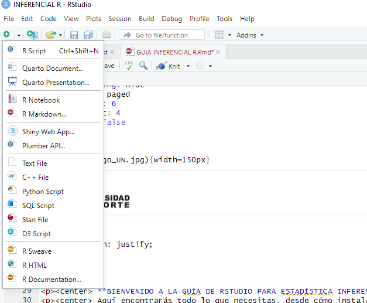
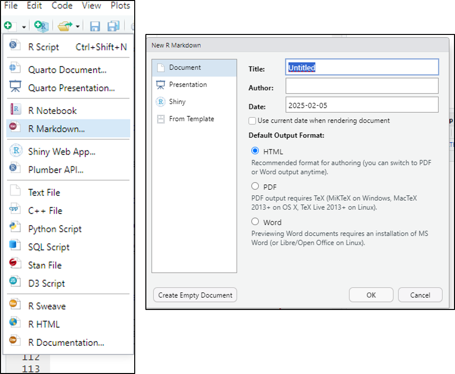
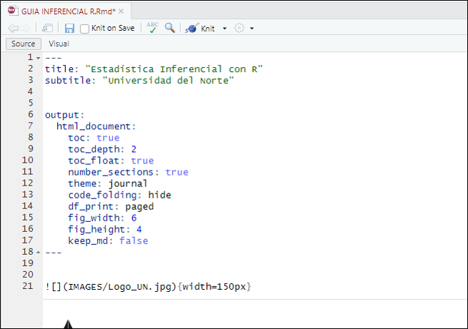
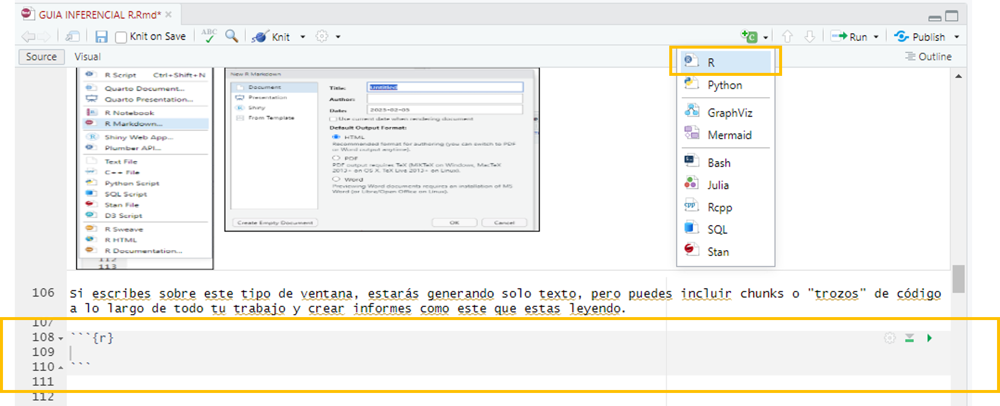
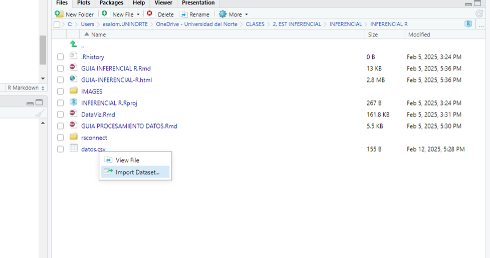

--- 
title: "Estadística Inferencial en Rstudio"
author: "Endy Paola Salon"
site: bookdown::bookdown_site
documentclass: book
bibliography: [book.bib, packages.bib]
# url: your book url like https://bookdown.org/yihui/bookdown
# cover-image: path to the social sharing image like images/cover.jpg
description: |
  Esta es una guía completa, complementaria al curso de Estadística Inferencial ¡Bienvenid@!.
link-citations: yes
github-repo: rstudio/bookdown-demo
---

{width=150px}
<style>
  body {
    text-align: justify;
  }
</style> <br>


<p><center> **BIENVENIDO A LA GUÍA DE RSTUDIO PARA ESTADÍSTICA INFERENCIAL**</center></p>  
<p><center> Aquí encontrarás todo lo que necesitas, desde cómo instalar el programa hasta los primeros pasos</center></p>

# Conoce Rstudio


## Instalación y Configuración de R-STUDIO

### Rstudio en tu equipo (escritorio)

Para comenzar a usar R, el primer paso es instalarlo en tu computadora. R es compatible con casi todas las plataformas, incluyendo los sistemas operativos más comunes. *Windows, Mac OS X y Linux*. [Links de descarga para y RStudio](https://posit.co/download/rstudio-desktop/). **Nota:** Antes de instalar Rstudio, debes instalar R (el motor)

RStudio es un entorno de desarrollo integrado (IDE) disponible para R, el cual tiene un buen editor con resaltado de sintaxis, un visor de objetos de R y un gran número de características agradables que están integradas.Ademas, esta dedicado a la computación estadística y gráficos.

**Otra opción: Rstudio en la nube**

Puedes utilizar Rstudio en cualquier dispositivo conectado a internet y guardar todos tus archivos en la nube. Encontras todo tal como lo dejaste en cualquier equipo. Recuerda que esta versión tiene un límite de horas de uso mensual. [Link de acceso a RStudio Cloud](https://posit.cloud/)


## Primeros pasos

**Rscript**

Puede resultar de mucha utilidad trabajar y guardar los comandos usados en un “script” de R. El script es básicamente un documento de texto donde puedes ir escribiendo todos los comandos a ejecutar, es la hoja de ruta que el programa seguirá para analizar tus datos. Considera el hecho de que si se antepone a una línea de comando el signo #, este no será ejecutado y el programa lo considerará como un comentario.

{width=500} 


**Paquetes o librerías en R**

Las librerías en R son colecciones de funciones, datos y documentación que amplían las capacidades del lenguaje base. También se les llama paquetes (packages). Estas librerías permiten a los usuarios realizar análisis de datos, visualización, modelado estadístico, aprendizaje automático, entre otras tareas, sin necesidad de programar todo desde cero.  

*Ejemplo: “Mundo” Tidyverse en R-Studio*

{width=500} 

El **Tidyverse** es una colección de paquetes del R que permiten preparar, procesar y graficar bases de datos. Se destacan los siguientes:

- **[ggplot](https://ggplot2.tidyverse.org/)**: permite crear visualizaciones elegantes de los datos de una manera relativamente sencilla.
- **[stringr](https://stringr.tidyverse.org/)**: permite manipular cadenas de caracteres con el fin de realizar sustituciones, detectar duplicados, analizar patrones, etc.

- **[tidyr](https://tidyr.tidyverse.org/)**: tiene como objetivo obtener datos ordenados. Destacan funciones como `gather` para crear factores con base en nombres de columnas y `separate` para crear factores separando los caracteres de una columna.

- **[readr](https://readr.tidyverse.org/)**: permite importar y exportar bases de datos en diferentes formatos y tiene implementada la función `problems` que detecta problemas en nuestras bases.

Para más información visitar la página web:  
[https://www.tidyverse.org/packages/](https://www.tidyverse.org/packages/)  

Para instalar librerías: Install.pachages("nombre de la librería") por primera vez y para llamarla o utilizarla library(nombre de la librería) o en su defecto, require(nombre de la librería)


```{r echo=TRUE, warning=FALSE}
# Instalar la librería (solo la primera vez)
#install.packages("tidyverse")

# Cargar la librería
library(tidyverse)

```


### Creación de reportes en R con R Markdown:

{width=500} 

R Markdown es un formato de documento que combina código R, texto y visualizaciones en un solo archivo, permitiendo generar informes dinámicos en varios formatos como HTML, PDF y Word. Es ampliamente utilizado en análisis de datos, reportes automatizados y documentación reproducible.

Se basa en el lenguaje Markdown para formatear el texto y en R para ejecutar código dentro del documento.

*¿Cómo funciona Rmarkdown?*

- En RStudio, ve a File > New File > R Markdown  
- Selecciona el formato de salida (HTML, PDF, Word).  
- Se generará un archivo con extensión .Rmd.  

{width=500}  

**Un archivo .Rmd tiene tres partes principales:**  

- Encabezado YAML: Define el título, autor y formato de salida.
- Texto en Markdown: Usa sintaxis Markdown para formatear el contenido.
- Chunks de código R: Secciones de código R que pueden ejecutarse y mostrar resultados.  

{width=500} 

Si escribes sobre este tipo de ventana, estarás generando solo texto, pero puedes incluir chunks o "trozos" de código a lo largo de todo tu trabajo y crear informes como este que estas leyendo.

{width=500} 


**Renderizar el documento**

- Para generar el documento final, haz clic en "Knit" en RStudio.
- Selecciona el formato de salida (HTML, PDF o Word).
- Se creará un archivo con los resultados y el código ejecutado.


{width=500} 

## Conceptos básicos de programación en R:

Si quieres aprender R, primero necesitas entender cómo funcionan los lenguajes de programación en general

Todos los lenguajes (incluyendo R) tienen ciertas bases comunes:  

- Variables → Almacenan datos.
- Operadores → Realizan cálculos o comparaciones.
- Estructuras de control → Permiten tomar decisiones y repetir tareas.
- Funciones → Agrupan código reutilizable.  

**Creación de Objetos**

R es un lenguaje orientado a objetos. Los objetos pueden ser usados para guardar valores y pueden madificarse mediante funciones como por ejemplo sumar dos objetos o calcular la media.

```{r echo=TRUE}
X <- 4
Y <- 2
```

```{r}
X+Y
```

**R como calculadora**

Puedes hacer operaciones matemáticas básicas como +, -, *, /.  
- También puedes calcular potencias (^), raíces cuadradas (sqrt()), logaritmos (log()) y funciones trigonométricas (sin(), cos(), tan()).
- print() se usa para mostrar los resultados en la consola.

- Prueba este código en RStudio y verás cómo R funciona como una calculadora avanzada.

```{r echo=TRUE, warning=FALSE}

# Operaciones básicas
5 + 3       # Suma
10 - 4     # Resta
6 * 7  # Multiplicación
20 / 5   # División

# Potencias y raíces
2^3     # 2 elevado a la 3
sqrt(16)  # Raíz cuadrada de 16

# Operaciones avanzadas
log(100, base = 10)  # Logaritmo base 10
exp(2)   # e^2
sin(pi / 2)  # Seno de 90 grados (π/2 radianes)

```

### Tipos de variables en R:

| **Tipo**      | **Ejemplo**                           | **Descripción**                   |
|--------------|--------------------------------------|-----------------------------------|
| **Numeric**  | `3.14, -2.5`                         | Números con decimales            |
| **Integer**  | `10L, -5L`                           | Números enteros                  |
| **Character**| `"Hola"`                             | Texto o cadenas de caracteres    |
| **Logical**  | `TRUE, FALSE`                        | Valores lógicos (booleanos)      |
| **Factor**   | `factor("azul", "rojo")`             | Variables categóricas            |
| **Date**     | `as.Date("2024-02-05")`              | Fechas                           |
| **POSIXct**  | `as.POSIXct("2024-02-05 14:30:00")`  | Fechas y horas                   |


```{r, echo=TRUE}
# Numéricas (Numeric)
num <- 3.14  # Número decimal
class(num)

# Enteros (Integer)
entero <- 10L  # Número entero
class(entero)

# Cadenas de Texto (Character)
texto <- "Hola, mundo"
class(texto)

# Lógicos (Logical)
logico <- TRUE
class(logico)

# Factores (Factor)
colores <- factor(c("rojo", "azul", "verde", "rojo"))
class(colores)
levels(colores)  # Ver categorías

# Fechas y Tiempos (Date y POSIXct)
fecha <- as.Date("2024-02-05")  # Convertir a fecha
hora <- as.POSIXct("2024-02-05 14:30:00")  # Fecha y hora
class(fecha)
class(hora)
```

*Nota: La función class permite ver qué tipo de variable estamos utilizando*

### Estructuras de Datos en R:

En R, los datos se pueden organizar en diferentes estructuras según la forma en que se almacena y manipula la información.

| **Estructura** | **Descripción**                                     | **Ejemplo**                        |
|----------------|-----------------------------------------------------|------------------------------------|
| **Vector**     | Secuencia de elementos del mismo tipo               | `c(1, 2, 3, 4, 5)`                |
| **Matrix**     | Tabla bidimensional con el mismo tipo de dato       | `matrix(1:9, nrow = 3, ncol = 3)` |
| **List**       | Contiene diferentes tipos de datos                  | `list(nombre = "Ana", edad = 25)` |
| **Data Frame** | Tabla con columnas de diferentes tipos              | `data.frame(Nombre = c("Ana", "Carlos"), Edad = c(25, 30))` |
| **Factor**     | Variable categórica con niveles                     | `factor(c("rojo", "azul", "verde"))` |
| **Array**      | Estructura multidimensional                         | `array(1:8, dim = c(2,2,2))`     |


*Vectores*

```{r}
# Vector numérico
vector <- c(1, 2, 3, 4, 5)
vector

# Vector de caracteres
caracteres<- c("rojo", "azul", "verde")
caracteres

# Vector lógico
logico <- c(TRUE, FALSE, TRUE)
logico

# Mostrar tipo
class(vector)

```

*Factor*

```{r}
# Crear un factor con categorías
colores <- factor(c("rojo", "azul", "verde", "rojo"))

# Ver niveles
levels(colores)

```

*Matriz*

```{r}
# Crear una matriz 3x3 con números del 1 al 9
matriz <- matrix(1:9, nrow = 3, ncol = 3)
matriz
# Mostrar matriz
print(matriz)

```

*Lista*

Puede contener diferentes tipos de datos (vectores, matrices, data frames, etc.).

```{r}
# Crear una lista con diferentes tipos de datos
mi_lista <- list(nombre = "Ana", edad = 25, notas = c(9, 8, 10))

# Mostrar contenido de la lista
print(mi_lista)

```

*Dataframe*

Es una tabla donde cada columna puede tener diferentes tipos de datos.  
Es la estructura más utilizada en análisis de datos.

```{r}
# Crear un data frame
df <- data.frame(Nombre = c("Ana", "Carlos", "Luis"),  Edad = c(25, 30, 22), Aprobado = c(TRUE, FALSE, TRUE))

# Mostrar data frame
df

```

*Condicional if-else.*

En R, la sintáxis del condicional consiste en:

- **`if (A)`**: evalúa si se cumple la condición A.
- **`else if (B)`**: si no se cumple la condición o condiciones anteriores, entonces evalúe si se cumple la condición B.
- **`else`**: si no se cumple ninguna de las condiciones anteriores entonces haga lo siguiente.

**Ejemplo:**

```{r}
a<-9
 if (a<0){
 print("a es negativo")
 }else if (a>0){
 print("a es positivo")
 }else{
 print("a es igual a cero")
 }
```

*Bucles for:*

Usado para repetir un bloque específico de código, siguiendo una secuencia dada.

```{r}
suma<-0
 for (i in 1:10){
 suma<-suma+i
 }
 suma
```


*Operadores de comparación en R:*

```{r}
# Asignación de valores
a <- 1
b <- 3

# Operaciones y comentarios explicativos

# ¿b es diferente de a?
b != a  # TRUE

# ¿es a igual a b?
isTRUE(a == b)  # FALSE

# Negar que a es menor que b
!(a < b)  # FALSE

# ¿es a menor que b o b menor que a?
(a < b | b < a)  # TRUE

# ¿es a menor o igual a b o b igual a a?
(a <= b & b == a)  # FALSE
```


<!--chapter:end:index.Rmd-->

# Exploración y Análisis de Datos (EDA)

Aquí encontraras las herramientas básicas para realizar un análisis exploratorio de Datos en Rstudio.El objetivo es conocer la información, qué primeras impresiones o tendencias mrevelan los datos.

---

## Dataframes (bases de datos)

Un **dataframe** en Rstudio es una estructura de datos similar a una tabla o base de datos, donde las columnas representan variables y las filas representan observaciones.


{width=600px}


### Creación de Dataframes

Es posible crear un dataframe a partir de la unión de vectores con la función `data.frame()`. 

```{r}

#Vectores o listas
nombre = c("Ana", "Luis", "Carlos", "Sofia")
edad = c(23, 25, 30, 22)
ciudad = c("Bogota", "Medellin", "Cali", "Barranquilla")
ingresos = c(2500000, 3000000, 2800000, 2700000)


# Crear un dataframe manualmente
df <- data.frame(nombre,edad,ciudad,ingresos)
  
# Ver el dataframe
df
```

**Acceso a los Datos del dataframe**

Para acceder a las columnas de un dataframe existen varias maneras

```{r}
# Acceder a una columna específica
df$nombre

```

```{r}
# Acceder a una fila específica
df[2, ]

```

```{r}

# Acceder a una celda específica
df[3, 2]
```


**Modificación de Dataframes**

Es posible agregar, modificar o eliminar columnas y filas en un dataframe


Agregar una nueva columna
```{r}
# Agregar una nueva columna

df$puntaje <- c(85, 90, 78, 88)
df

```


Modificar un valor
```{r}
# Modificar un valor

df$ingresos[1] <- 2600000

```

Eliminar una columna
```{r}
# Eliminar una columna

df$ciudad <- NULL
df

```


**Filtrado de Datos**

También, es posible filtrar filas que cumplen ciertas condiciones:

```{r}

# Filtrar personas con ingresos mayores a 2.8 millones
subset(df, ingresos > 2800000)

```

```{r}

# Filtrar personas con puntaje mayor a 80
df[df$puntaje > 80, ]

```


**Ordenamiento de Dataframes**

```{r}

# Ordenar por edad
df_ordenado <- df[order(df$edad), ]
df_ordenado

```

**Guardar Dataframes**

Guardar un dataframe como un archivo CSV (Este es un formato muy común en el que se suelen encontrar las bases de datos):

```{r}
# Guardar dataframe en un archivo CSV

write.csv(df, "datos.csv", row.names = FALSE)
help("write.csv")

```


### Importar un Dataframe desde un archivo CSV

```{r}
# Leer un archivo CSV

df_importado <- read.csv("datos.csv")
df_importado

```

Otra forma para importar datos, es a través de la ventana de archivos

{width=600px}
<style>
  body {
    text-align: justify;
  }
</style> <br>

También es posible importar datos directamente desde donde esté guardada la base de datos en el equipo (cuando se utiliza la versión Rstudio de escritorio) La línea de código sería la siguiente:

```{r eval=FALSE, include=FALSE}
library(readr)
datos <- read_csv("C:/Users/esalom.UNINORTE/Downloads/datos.csv.csv")
datos
```


## Pre procesamiento de una Base de Datos Preinstalada en R

R incluye varias bases de datos preinstaladas. En este ejemplo, usaremos `mtcars`, una base de datos con información sobre automóviles.

```{r}
# Cargar la base de datos mtcars
data("mtcars")
```

```{r}
datos <- mtcars
head(datos)# Ver las primeras filas
```


**Exploración de Datos**

Para ver las dimensiones del dataframe o el tamaño de mi base de datos:

```{r}
# Dimensiones del dataframe
dim(datos)
```

Ver los tipos de datos o variables
```{r}
# Ver estructura de los datos
str(datos)
```
Hacer un resumen estadístico (muy general). Esta es la primera impresión de todas las variables
```{r}
# Resumen estadístico general
summary(datos)
```


**Verificación y Manejo de Datos Faltantes**

Verificar:

```{r}
# Verificar valores faltantes
sum(is.na(datos))
```
Eliminar:
```{r}
# Si hubiera valores NA, podríamos eliminarlos con:
df <- na.omit(datos)
```


::: warning
La solución a los datos faltantes NO SIEMPRE va a ser eliminarlos. Es muy importante dar el tratamiento correcto.
:::


**Eliminación de Columnas Innecesarias**

Si algunas columnas no son relevantes para el análisis, es posible eliminarlas.

```{r}
# Eliminar la columna 'carb'
datos
datos$carb <- NULL
head(datos)
```

**Filtrado de Datos**

Se pueden filtrar observaciones basadas en condiciones específicas.

```{r}
# Filtrar autos con más de 20 millas por galón (mpg)

df_filtrado <- subset(datos, mpg > 20)
df_filtrado
```

**Transformación de Datos**

Podemos agregar columnas nuevas basadas en cálculos.

```{r}
# Crear una nueva columna con consumo en km por litro

datos$km_per_l <- datos$mpg * 0.425144
head(datos)

```

**Cambio de Tipo de Variable**

Podemos convertir una variable numérica en categórica.

```{r}
str(datos)
```


```{r}
# Convertir la variable 'cyl' (cilindros) en factor
datos$cyl <- as.factor(datos$cyl)
```


```{r}
# Ver estructura para confirmar el cambio
str(datos)
```


**Ordenamiento de Datos**

```{r}
# Ordenar por caballos de fuerza (hp)
df_ordenado <- datos[order(datos$hp), ]
head(df_ordenado)
```


**Actividades para practicar**

1. **Crea un dataframe** con datos de 5 amigos, incluyendo nombre, edad y ciudad.
2. **Filtra** las personas mayores de 25 años.
3. **Agrega una nueva columna** con su ocupación.
4. **Guarda el dataframe** en un archivo CSV y vuelve a importarlo en R.


---

## Análilsis exploratorio de Datos (EDA) básico


El análisis exploratorio de datos ([Ver video](https://www.youtube.com/watch?v=UeMpYEktLfU&ab_channel=Comunicaci%C3%B3nNum%C3%A9rica)) (EDA por sus siglas en inglés) implica el uso de gráficos y visualizaciones para explorar y analizar un conjunto de datos. El objetivo es explorar, investigar y aprender, no confirmar hipótesis estadísticas.

**¿Cuándo debo utilizarlo?**

El análisis exploratorio de datos es una potente herramienta para explorar un conjunto de datos. Incluso cuando su objetivo es efectuar análisis planificados, el EDA puede utilizarse para limpiar datos, para análisis de subgrupos o simplemente para comprender mejor los datos. Un paso inicial importante en cualquier análisis de datos es representar los datos gráficamente.

**No gráfico:** Calcula estadísticas descriptivas de las variables

**Gráfico:** Calcula estadísticas de forma gráfica

**Univariado:** Analiza una sola variable a la vez

**Multivariado:** Analiza dos o más variables

A su vez, cada uno de esas dividisiones puede subdividirse según los tipos de datos con los que trabajemos: categóricos o numéricos.


### Ejemplo (Contexto):

El presente estudio se basa en una encuesta aplicada a una muestra representativa de 500 ciudadanos de la ciudad de Springfield, con el objetivo de analizar su nivel de confianza en el gobierno, entre otras. Además, se examina el impacto de las redes sociales en la formación de la opinión pública y su posible influencia en el comportamiento electoral.

Para garantizar la calidad de los datos y obtener conclusiones válidas, es necesario realizar un Análisis Exploratorio de Datos (EDA) antes de proceder con cualquier modelado estadístico o inferencia.


**La base de datos contiene las siguientes variables:**


| Variable                          | Tipo de Variable | Categoría/Tipo | Descripción |
|-----------------------------------|----------------|---------------------------|-------------|
| Edad                              | Numérica       | Continua                      | Años cumplidos |
| Género                            | Categórica     | Nominal                    | Identificación de género (Masculino, Femenino, No Binario) |
| Nivel de Educación                | Categórica     | Ordinal                    | Último nivel educativo alcanzado (Primaria, Secundaria, Universitaria, Posgrado) |
| Ingreso Mensual                   | Numérica       | Continua                      | Ingresos mensuales en moneda local |
| Interés en Política               | Categórica       | Ordinal                     | Nivel de interés en política (Escala Likert del 1 al 5) |
| Frecuencia de Voto                | Categórica     | Ordinal                     | Frecuencia con la que vota (Nunca, A veces, Siempre) |
| Ideología Política                | Categórica     | Nominal                     | Identificación ideológica (Izquierda, Centro, Derecha) |
| Confianza en el Gobierno          | Categórica       | Ordinal                     | Nivel de confianza en el gobierno (Escala Likert del 1 al 10) |
| Uso de Redes para Informarse      | Categórica     | Ordinal                     | Nivel de uso de redes sociales para informarse (Bajo, Medio, Alto) |
| Participación en Protestas        | Categórica     | Nominal                     | Si ha participado en protestas (Sí, No) |


***Instalar y Cargar paquetes***

Lo primero que tenemos que hacer es cargar los paquetes que vamos a utilizar para el análisis. En este caso vamos a usar:

```{r warning=FALSE}

library(tidyverse)# Incluye paquetes de importación, visualización entre otros
library(dplyr)# Manipulación de Datos
library(ggplot2)# Visualización de datos 
library(readxl)# Importación de datos
library(tibble)# Tablas
library(readr) #Para cargar la base de datos

```

::: warning

Si no ha instalado estos paquetes debe correr primero el comando: **`install.packages("nombre del paquete")`**, **Recuerde que los paquetes deben instalarse una única vez, posteriormente se pueden llamar utilizando la función "library"**

:::


### Cargar base de datos:

Tenga en cuenta que debe utilizar la dirección de donde está guardada la base de datos en caso de usar Rstudio descargado en su equipo, o importarlo en la carpeta files en caso de estar trabajando en Rstudio cloud.
**Aquí puede ir a un video acerca de importación de datos o datasets: **([Ver video para Rstudio de escritorio](https://www.youtube.com/watch?v=agkPSaYEDgQ)) o también ([Ver video para Rstudio Cloud](https://www.youtube.com/watch?v=anWyri9tbzk))**

```{r echo=TRUE}
datos <- read_csv("DATA/dataset_opinion_publica.csv") #Ojo esta es la dirección en la que la profe tenía guardados sus datos, es necesario cambiarla.
```

**Nombres de variables**
Aquí podemos ver qué variables fueron importadas en nuestro Data Frame:

```{r}
names(datos)# nombres de variables
```
**Mostrar o llamar una variable**

```{r}
head(datos$nivel_de_educacion) #Se utiliza el simbilo $ despues del nombre de la base. Se uba la función head para mostrar solo los primero sdatos y no todos.
```


**Dimensiones**

Es importante conocer las dimensiones del Dataset cargado para asegurarse que se incluyeron todas las variables y observaciones.

```{r}
dim(datos) #Dimensiones: num filas x num columnas
```
**Mostrar las primeras filas de la base de datos**

```{r}
head(datos)
```


**Tipos de datos**
Con esto es posible verificar que los datos están correctamente cargados de acuerdo a la naturaleza de cada variable:

```{r}
str(datos)
```

Supongamos que las variables **Interés en política** y **Confianza en el gobierno** se deben manejar como variables categóricas, pero R las lee como numéricas. Es posible cambiar el tipo de variable:

```{r}
#Convertir variables en factores
datos$interes_en_politica <- as.factor(datos$interes_en_politica) #OJO: con el signo "$" llamo a una variable específica de mi dataset
datos$confianza_en_gobierno <- as.factor(datos$confianza_en_gobierno)
```

Revisar nuevamente el Dataset:

```{r}
str(datos)
```

### Revisión de valores faltantes (N/A):

Sumar N/As por cada columna (variable)

```{r}
# Contar valores faltantes por variable
colSums(is.na(datos))
```


::: warning

**Nota importante:** Cuando se identifican datos faltantes en un conjunto de datos durante un Análisis Exploratorio de Datos (EDA), es fundamental evaluar su impacto en el análisis y decidir el mejor método para tratarlos. El primer paso consiste en cuantificar la cantidad de valores ausentes y analizar su distribución a lo largo de las variables. Si los valores perdidos son escasos y aleatorios, una opción válida puede ser eliminarlos sin afectar significativamente los resultados. Sin embargo, cuando los valores faltantes son numerosos o siguen un patrón sistemático, es recomendable aplicar métodos de imputación, como el reemplazo por la media o mediana en variables numéricas, o el uso de la moda en variables categóricas. También pueden emplearse técnicas más avanzadas, como la imputación por regresión o el uso de modelos de aprendizaje automático. 

En cualquier caso, **la decisión sobre el tratamiento de los datos ausentes debe tomarse considerando el contexto del estudio y asegurando que no se introduzcan sesgos que afecten la validez de las conclusiones.**


:::


### Revisión de valores atípicos (outliers)

**Nota importante:** La detección de valores atípicos es un paso crucial en un Análisis Exploratorio de Datos (EDA), ya que estos pueden influir en la interpretación de los resultados y en la robustez de los modelos estadísticos. **Un valor atípico es una observación que se aleja significativamente del resto de los datos** y puede ser causado por errores de medición, registros incorrectos o, en algunos casos, por la naturaleza de la propia distribución de los datos. Para identificarlos, se pueden utilizar técnicas gráficas como los gráficos de caja y bigotes. 

Una vez detectados, es importante analizar su origen: si los valores son producto de errores, pueden ser corregidos o eliminados; si son casos extremos pero válidos, se pueden utilizar transformaciones más complejas para reducir su impacto. **La decisión de mantener, corregir o eliminar valores atípicos debe basarse en la naturaleza del problema y el contexto del estudio, asegurando que el análisis refleje con precisión la realidad de los datos.**  


Un resumen estadístico general de las variables nos puede mostrar el resumen de los cinco números para las variables numéricas: (mínimo, primer cuartil, segundo cuartil (que equivale a la mediana), tercer cuartil y valor máximo). Estos cinco números nos brindan una idea de la distribución de los datos: **la media se ve alterada por valores extremos, mientras que la mediana no**, cuando la media se aleja mucho de la mediana, puede ser un indicador de datos atípicos o extremos.

En este caso, las variables numéricas son **Edad e Ingreso mensual:**

```{r}
# Resumen estadístico general
summary(datos)
```


::: note

Note que la media y mediana de la edad son muy similares, mientras que en el caso de ingreso mensual, se alejan un poco más. Note también que el valor máximo en esta última variable se encuentra alejado del tercer cuartil. Todo esto lo podemos visualizar mejor en un gráfico de Caja y Bigotes.

:::


**Caja y bigotes para la variable edad**

```{r}
boxplot(datos$edad, horizontal=TRUE, col='steelblue', main="Boxplot de edad")
```

**Caja y bigotes para la variable Ingreso mensual**


```{r}
# Desactivar notación científica (cuando las cifras son muy largas)
options(scipen=999)

# Generar el boxplot sin notación científica
boxplot(datos$ingreso_mensual, horizontal=TRUE, col='cadetblue4', main="Boxplot de Ingreso Mensual")
```

El gráfico se ve de esta manera por los valores extremos. Así se vería sin esos datos atípicos:

```{r}
# Desactivar notación científica
options(scipen=999)

# Generar boxplot sin valores extremos
boxplot(datos$ingreso_mensual, horizontal=TRUE, col='cadetblue4', 
        main="Boxplot de Ingreso Mensual (Sin Valores Extremos)", 
        outline=FALSE)  # Esto elimina los valores atípicos visualmente
```
En esta ocasión, reemplazaremos los atípicos por el valor de la mediana a manera de imputación:

```{r}
# Calcular la mediana del ingreso mensual
mediana <- median(datos$ingreso_mensual, na.rm=TRUE)

# Reemplazar valores atípicos con la mediana
datos$ingreso_mensual <- ifelse(datos$ingreso_mensual %in% boxplot.stats(datos$ingreso_mensual)$out, 
                                mediana, 
                                datos$ingreso_mensual)

# Verificar con un nuevo boxplot
boxplot(datos$ingreso_mensual, horizontal=TRUE, col='cadetblue4', 
        main="Boxplot de Ingreso Mensual (Atípicos Reemplazados con Mediana)")
```

### Exploración de variables:

**Representación en tablas:**

Tabla de Frecuencia para Nivel de Educación

```{r}

# Tabla de Frecuencia para Nivel de Educación
tabla_educacion <- table(datos$nivel_de_educacion)
print(tabla_educacion)


```

Tabla de Frecuencia para Ideología Política
```{r}

# Tabla de Frecuencia para Ideología Política
tabla_ideologia <- table(datos$ideologia_politica)
print(tabla_ideologia)

```

Tabla de Frecuencia para interés en política
```{r}

# Tabla de Frecuencia para interés en política
tabla_interes_pol <- table(datos$interes_en_politica)
print(tabla_interes_pol)

```

Tabla de frecuencia agrupada para ingreso mensual

```{r}
# Determinar automáticamente el número de intervalos con la regla de Sturges
num_intervals <- nclass.Sturges(datos$ingreso_mensual)

# Agrupar ingresos en intervalos automáticos
datos$ingreso_grupo <- cut(datos$ingreso_mensual, breaks = num_intervals, include.lowest = TRUE)

# Crear la tabla de frecuencia
tabla_ingreso <- table(datos$ingreso_grupo)

# Convertir en data frame para mejor presentación
tabla_ingreso_df <- as.data.frame(tabla_ingreso)
colnames(tabla_ingreso_df) <- c("Rango de Ingreso", "Frecuencia")

# Calcular la frecuencia relativa
frecuencia_relativa <- prop.table(tabla_ingreso) * 100  # Convertir a porcentaje
tabla_ingreso_df$frecuencia_relativa <- round(frecuencia_relativa, 2)  # Agregar columna con % y redondear

tabla_ingreso_df #Mostrar la tabla resultante

```


### Gráficos:


::: note

**Nota:** Encuentra aquí la guía de colores para tus gráficos > **([guía de colores](https://www.datanovia.com/en/blog/awesome-list-of-657-r-color-names/))

:::


Gráfico para la variable genero:

```{r}
ggplot(datos, aes(x = genero, fill = genero)) +  
  geom_bar() +  
  labs(title = "Distribución de Género", x = "Género", y = "Frecuencia") +  
  theme_minimal()
```

Gráfico para la variable edad:

```{r}
ggplot(datos, aes(x = edad)) +  
  geom_histogram(bins = 10, fill = "steelblue", color = "black", alpha = 0.7) +  
  labs(title = "Distribución de Edades", x = "Edad", y = "Frecuencia") +  
  theme_minimal()
```


Gráfico para ingreso mensual
```{r}
ggplot(datos, aes(x = ingreso_mensual)) +  
  geom_histogram(bins = 10, fill = "cyan4", color = "black", alpha = 0.7) +  
  labs(title = "Distribución del Ingreso Mensual", x = "Ingreso Mensual", y = "Frecuencia") +  
  theme_minimal()
```


Gráfico para ideología

```{r}
ggplot(datos, aes(x = ideologia_politica, fill = ideologia_politica)) +  
  geom_bar() +  
  labs(title = "Distribución de la Ideología Política", x = "Ideología Política", y = "Frecuencia") +  
  theme_minimal()
```

Gráfico circular para voto

```{r}
tabla_voto <- table(datos$frecuencia_de_voto)
df_voto <- as.data.frame(tabla_voto)
colnames(df_voto) <- c("Frecuencia de Voto", "Frecuencia")

ggplot(df_voto, aes(x = "", y = Frecuencia, fill = `Frecuencia de Voto`)) +  
  geom_bar(stat = "identity", width = 1) +  
  coord_polar("y", start = 0) +  
  labs(title = "Frecuencia de Voto (Gráfico Circular)") +  
  theme_void()
```

### Análisis Bivariado


diagrama de barras agrupadas genero vs votos

```{r}
# Crear gráfico de barras agrupadas
ggplot(datos, aes(x = frecuencia_de_voto, fill = genero)) +  
  geom_bar(position = "dodge") +  # "dodge" agrupa las barras
  labs(title = "Frecuencia de Voto por Género", x = "Frecuencia de Voto", y = "Cantidad de Personas") +  
  theme_minimal()
```

diagrama de cajas y bigotes genero vs ingresos mensuales

```{r}
# Crear el boxplot de ingreso mensual según género
ggplot(datos, aes(x = genero, y = ingreso_mensual, fill = genero)) +  
  geom_boxplot() +  # Agregar boxplot
  labs(title = "Distribución del Ingreso Mensual por Género", 
       x = "Género", 
       y = "Ingreso Mensual") +  
  theme_minimal()
```


Diagrama de dispersión Edad vs ingreso

```{r}
# Relación entre edad e ingreso
ggplot(datos, aes(x = edad, y = ingreso_mensual)) +
  geom_point(alpha = 0.5, color = "blue") +
  geom_smooth(method = "lm", color = "red") +
  theme_minimal() +
  ggtitle("Relación entre Edad e Ingreso")

```

Matriz de correlación entre variables numéricas

```{r}
#Correlación entre variables numéricas 

# Cargar librería necesaria
library(corrplot)

# Seleccionar solo las variables numéricas de interés
datos_correlacion <- datos[, c("edad", "ingreso_mensual")]

# Calcular la matriz de correlación
matriz_cor <- cor(datos_correlacion, use = "complete.obs")

# Mostrar matriz de correlación en consola
print(matriz_cor)

```
---


### Conlusiones

El Análisis Exploratorio de Datos (EDA) realizado sobre la encuesta de opinión pública permitió identificar patrones y relaciones clave entre variables sociodemográficas y políticas. A través del análisis de distribuciones, correlaciones y visualizaciones, se detectaron valores faltantes y valores atípicos. El EDA es un paso esencial y no opcional en cualquier investigación cuantitativa, ya que proporciona una comprensión profunda de los datos y permite tomar decisiones informadas sobre el tratamiento de variables y la aplicación de modelos.

**Hallazgos**

- **Edad** : La distribución de edades es relativamente uniforme, sin concentraciones extremas en grupos específicos.

- **Género**: Se observó una distribución equilibrada de género en la muestra. El análisis de caja y bigotes mostró que existen diferencias en los ingresos según el género, con una mediana salarial mayor en ciertos grupos. 

- **Nivel de Educación**: La mayoría de los encuestados tienen estudios universitarios, seguidos de aquellos con educación secundaria. .  

- **Ingreso Mensual**: Se identificaron valores atípicos, lo que indica la presencia de individuos con ingresos significativamente mayores que el resto. La distribución de ingresos no es homogénea, con una concentración en los rangos medios y menores diferencias por edad.  

- **Frecuencia de Voto**️ : La mayoría de los encuestados afirmaron votar siempre o a veces, con pocos casos de abstención total. 


<!--chapter:end:01-Exploraciondatos.Rmd-->

# Distribuciones Muestrales

En esta sección exploraremos las principales distribuciones de probabilidad utilizadas en estadistica, su interpretacion, su aplicacion en R y la manera en que pueden ser visualizadas. 


## Estadísticos:
Con estos ejercicios vamos a simular que calculamos estadísticos para algunas variables.

### Datos númericos (media, varianza y desviación estándar)

Crear una secuencia de datos numéricos
```{r}
x <- seq(1, 5, length = 100) #Crear un vector 100 números desde el 1 hasta el 5
x
```

**Media**
```{r}
mean(x)
```

**Desviación estándar**
```{r}
sd(x)
```

### Datos categóricos (proporción)

En R, puedes crear un vector dicotómico que represente, por ejemplo, si una persona tiene o no tiene acceso a Internet en su hogar 

Vector categórico

```{r}
# Crear un vector categórico con "S" (Sí) y "N" (No)
acceso_internet <- c("S", "S", "N", "S", "N", "S", "S", "N", "S", "N", "S", "S", "S", "N", "N")


```


***Proporción: Función mean***

```{r}
# Crear un vector categórico con "S" (Sí) y "N" (No)
acceso_internet <- c("S", "S", "N", "S", "N", "S", "S", "N", "S", "N", "S", "S", "S", "N", "N")

# Calcular la proporción de "S" y "N"
prop_S2 <- mean(acceso_internet == "S")  # Proporción de "S"
prop_N2 <- mean(acceso_internet == "N")  # Proporción de "N"

```


Proporciones: 

```{r}
prop_S2
prop_N2
```

**Cuando se representa con (1 = Sí, 0 = No). Luego, puedes calcular la proporción de cada categoría solo calculando la media,

```{r}
# Crear un vector dicotómico (1 = Tiene acceso a Internet, 0 = No tiene)
y <- c(1, 1, 0, 1, 0, 1, 1, 0, 1, 0, 1, 1, 1, 0, 0, 1, 0, 0, 1,0, 1, 1, 1, 1)
```

Proporciones:

```{r}
prop_1 <- mean(acceso_internet == 1)  # Proporción de personas con acceso
prop_0 <- mean(acceso_internet == 0)  # Proporción de personas sin acceso

prop_1
prop_0
```


## Comandos `dpqr` para distribuciones de probabilidad

R proporciona cuatro funciones fundamentales para manejar distribuciones de probabilidad, se utilizan **comando + distribución***:  

+ **d**: Calcula la funcion de densidad de probabilidad (PDF) o la funcion de masa de probabilidad (PMF) para una distribucion.  
+ **p**: Calcula la funcion de distribucion acumulada (CDF), que nos dice la probabilidad de obtener un valor menor o igual a un punto dado.  
+ **q**: Calcula cuantiles o percentiles de la distribucion.  
+ **r**: Genera valores aleatorios a partir de la distribucion especificada.

### <font color="red"> d </font> (densidad): Funcion de Densidad de Probabilidad (PDF)


**La densidad de probabilidad** es una función matemática que describe la probabilidad relativa de que una variable aleatoria tome un valor específico dentro de un rango. En el caso de una distribución continua, como la normal, la probabilidad exacta de un solo punto es cero, por lo que en su lugar analizamos la densidad de probabilidad.


Ejemplo, creamos un vector numéricos:

```{r dnorm-example}

x <- seq(1, 5, length = 100)
x

```
```{r}
mean(x)
sd(x)
```

**Usamos la función d + la distribución** esta funcion devuelve la densidad de probabilidad en un punto especifico de la distribucion normal estandar. Nos dice **que tan probable es que un valor especifico ocurra**. Obtendremos las probabilidades para cada valor de x:

```{r}
#Aquí se utiliza la función d:

densidad <- dnorm(x, mean = 3 , sd = 1)
densidad

```

Graficar la densidad (probabilidad para cada valor de x):

```{r}
plot(x, densidad, type = "l", col = "blue", main = "Densidad de Probabilidad Normal",
     ylab = "Densidad", xlab = "Valores")
```


En el grafico, los valores cercanos a la media (0) tienen mayor probabilidad.


### <font color="red"> p </font> (probabilidad acumulada): Funcion de Distribucion Acumulada: 

Esta funcion devuelve la **probabilidad acumulada** de que un valor sea menor o igual a un punto dado.  


```{r}
#Probabilidad acumulada Z hasta 1.96
pnorm(1.96, mean=0, sd=1)
```

La probabilidad acumulada hasta que Z valga 1.96 es del 0.975.
Recuerde que estamos hablando de una distribución Z porque usamos la función p + norm (normal) con media = o y desviación = 1.

Si `pnorm(1.96, mean=0, sd=1)` da 0.975, significa que el 97.5% de los valores en una normal estandar son menores a 1.96 en otras palabras.


### <font color="red"> q </font> (cuartiles - valores de la variable x): Cuantiles o Percentiles
Esta funcion devuelve el valor **correspondiente a un percentil dado**, no aroja probabilidad, si no, el valor que tomaría X de acuerdo a la posición percentil.

Ejemplo:

```{r qnorm-example}

qnorm(0.975, mean = 0, sd = 1)
 
```

::: note

Note que esta función hace lo contrario a la anterior, ***Le ingresamos una probabilidad y nos arroja el valor de x, en este caso Z***
:::


### <font color="red"> r </font> (ramdom values): Generacion de Valores Aleatorios

Esta funcion genera valores aleatorios de una distribucion con los parametros dados, en este caso normal:


```{r rnorm-example}
set.seed(123) # Para reproducibilidad, para que se generen siempre los mismos valores, si no se usa, cada vez que ejecute las líneas de código, se crearán valores aleatorios nuevos.

datos = rnorm(100, mean = 0, sd = 1)
datos

```

***Se crearon 100 números aleatorios que siguen una distribución normal estándar.***


::: warning

set.seed() es una función en R que establece una semilla aleatoria para la generación de números pseudoaleatorios. Esto significa que garantiza que los resultados de cálculos aleatorios sean reproducibles cada vez que se ejecuta el código. **Si no se fija una semilla con set.seed(), cada vez que ejecutes el código obtendrás diferentes valores aleatorios.**
:::


```{r}
hist(datos, breaks = 30, col = "lightblue", main = "Muestra Aleatoria de distribución Normal",
     xlab = "Valores")
```

Aqui generamos 1000 valores aleatorios de una normal estandar y los visualizamos en un histograma.


---


## Distribuciones de probabilidad discretas

A continuacion, exploramos tres distribuciones discretas: **Bernoulli, Binomial y Poisson**.


### Distribucion de Bernoulli

La distribucion de Bernoulli modela experimentos con solo dos posibles resultados: **exito (1) o fracaso (0)**. La funcion de masa de probabilidad (PMF) es:

\[
P(X = x) = p^x (1-p)^{1-x}, \quad x \in \{0,1\}
\]


```{r bernoulli}

p <- 0.5  # Probabilidad de exito
x <- c(0, 1)

densidad_bernoulli <- dbinom(x, size = 1, prob = p)

barplot(densidad_bernoulli, names.arg = x, col = "steelblue",
        main = "Distribucion de Bernoulli", ylab = "Probabilidad", xlab = "Valores")
```


### Distribucion Binomial

La distribucion binomial modela el numero de exitos en `n` ensayos independientes de Bernoulli con probabilidad `p`. Su PMF es:

\[
P(X = k) = \binom{n}{k} p^k (1-p)^{n-k}, \quad k = 0,1,\dots,n
\]


```{r binomial}
 
densidad_binomial <- dbinom(0:10, size = 10, prob = 0.5) # size = número de ensayos y prob = Probabilidad de exito

barplot(densidad_binomial, names.arg = 0:10, col = "steelblue",
        main = "Distribucion Binomial", ylab = "Probabilidad", xlab = "Numero de exitos")
```


## Distribuciones de probabilidad continuas

### Distribucion Normal

La distribucion normal es una de las mas utilizadas en estadistica debido a su presencia en fenomenos naturales y cientificos. Se caracteriza por dos parametros:
- **Media (`mu`)**: Indica el centro de la distribucion.
- **Desviacion estandar (`sigma`)**: Define la dispersion de los datos.

La funcion de densidad de probabilidad para la distribucion normal es:

\[ f(x) = \frac{1}{\sigma \sqrt{2\pi}} e^{-\frac{(x-\mu)^2}{2\sigma^2}} \]

En R podemos visualizarla de la siguiente manera:

```{r normal}

x <- seq(4, 8, length = 100) #Crear una secuencia de 100 números del -4 al 4
x

```

```{r}

densidad <- dnorm(x, mean = 6, sd = 0.5) #obtener las densidades (p) de cada número para la distribución Normal estandar y guardarlos en el objeto "densidad"
densidad

```

```{r}
plot(x, densidad, type = "l", col = "blue", main = "Distribucion Normal",
     ylab = "Densidad", xlab = "Valores")
```


### Distribucion Normal Estandar

Es un caso especial de la normal con media 0 y desviacion estandar 1.

```{r normal-estandar}

x <- seq(-4, 4, length = 100)

densidad <- dnorm(x, mean = 0, sd = 1)

```

```{r}
plot(x, densidad, type = "l", col = "red", main = "Densidad de la distribución Normal Estandar",
     ylab = "Densidad", xlab = "Valores")
```


### Distribucion t de Student

Esta distribucion se utiliza cuando el tamano de la muestra es pequeno y la varianza poblacional es desconocida. Su funcion de densidad es:

\[ f(t) = \frac{\Gamma((v+1)/2)}{\sqrt{v\pi} \Gamma(v/2)} \left( 1 + \frac{t^2}{v} \right)^{-(v+1)/2} \]

donde \( v \) es el numero de grados de libertad.

```{r t-student}

x <- seq(-4, 4, length = 100)

densidad_t <- dt(x, df = 10) #df significa: Grados de libertad

```


```{r}
plot(x, densidad_t, type = "l", col = "green", main = "Distribucion t de Student",
     ylab = "Densidad", xlab = "Valores")
```


***Los grados de libertad en la distribución t:***

Para visualizar la convergencia de la distribucion t a la normal estandar a medida que aumentan los grados de libertad, graficamos ambas en la misma figura.

```{r}

x <- seq(-4, 4, length = 100)

# Definir los grados de libertad
grados_libertad <- c(1, 5, 28)
colores <- c("red", "green", "orange")

```

Graficando en comparación con la distribución Normal Estándar:

```{r t-vs-normal}

# Graficar la distribucion normal estandar
plot(x, dnorm(x, mean = 0, sd = 1), type = "l", col = "black", lwd = 2,
     main = "Comparacion entre la Distribucion t y la Normal Estandar",
     ylab = "Densidad", xlab = "Valores", ylim = c(0, 0.45))

# Agregar las distribuciones t con diferentes grados de libertad
for (i in 1:length(grados_libertad)) {
  lines(x, dt(x, df = grados_libertad[i]), col = colores[i], lwd = 2)
}

# Agregar una leyenda
legend("topright", legend = c("Normal Estandar", paste("t (df=", grados_libertad, ")")),
       col = c("black", colores), lwd = 2)
```

### Distribucion Chi-cuadrado
Esta distribucion se usa en pruebas de hipotesis y analisis de varianza. Se obtiene como la suma de los cuadrados de \( k \) variables aleatorias normales estandar.

Su funcion de densidad es:
\[ f(x) = \frac{x^{(k/2)-1} e^{-x/2}}{2^{k/2} \Gamma(k/2)} \]

```{r chi-cuadrado}

x <- seq(0, 20, length = 100)

densidad_chi2 <- dchisq(x, df = 5) #df significa grados de libertad

plot(x, densidad_chi2, type = "l", col = "purple", main = "Distribucion Chi-cuadrado",
     ylab = "Densidad", xlab = "Valores")
```

### Distribucion F

Se usa para comparar varianzas en pruebas de hipotesis. Es la razon de dos distribuciones Chi-cuadrado divididas por sus respectivos grados de libertad:

\[ F = \frac{(\chi^2_{df1} / df1)}{(\chi^2_{df2} / df2)} \]

```{r f-distribucion}

x <- seq(0, 5, length = 100)
densidad_f <- df(x, df1 = 5, df2 = 10) #df1 y df2 son lso grados de libertad


plot(x, densidad_f, type = "l", col = "orange", main = "Distribucion F",
     ylab = "Densidad", xlab = "Valores")
```


---


## Distribuciones muestrales: Simulaciones de múltiples muestras

Las distribuciones muestrales describen la variabilidad de un estadístico muestral (como la media, proporción o varianza) a través de diferentes muestras tomadas de una misma población.  

::: warning

**Diferencia clave**  
Mientras que una distribución de probabilidad describe cómo se comporta una sola variable aleatoria,
Una distribución muestral describe **cómo varía un estadístico**, como la media muestral, al tomar muchas muestras.  
:::


### Simulación de la distribución muestral de la media
```{r}

set.seed(123) #Sembrar semilla para que solo se generen valores aletorios una vez
medias <- numeric(1000)  # Vector vacío para guardar las medias

```

Se crean 1000 muestras de 30 observaciones cada, cada una a partir de una distribución normal com media 50 y desviación estándar de 10.
Luego, se guardan todas las medias muestrales.

```{r} 

#Esto es un blucle: acción repetitiva:

for (i in 1:1000) { #Para cada i desde 1 hasta 1000, generar una muestra a partir de una distribución normal
  muestra <- rnorm(30, mean = 50, sd = 10)  # Cada muestra tiene 30 observaciones y sigue distribución normal con media 50 y desvición estándar de 10
  medias[i] <- mean(muestra)  # Guardamos las medias muestrales en el vector medias
}

head(medias) #Mostrar las primeras medias generadas

```

Graficando la media de cada muestra en un histograma:

```{r}

hist(medias, breaks = 30, col = "lightblue", probability = TRUE,
     main = "Distribucion Muestral de la Media",
     xlab = "Media Muestral")
lines(density(medias), col = "red", lwd = 2)  # Agregamos la curva de densidad

```


La forma de campana describe cómo el histograma se aproxima a una distribución normal.

### Simulación de la distribucion Muestral de la Varianza

La distribucion de la varianza muestral sigue una **distribucion chi-cuadrado**. 

Ahora vamos a generar nuevamente 1000 muestras de tamaño 30 que sigan distribución normal con media 50 y desviación estándar de 30:

```{r simulacion-varianza}

set.seed(123) #Semilla para que no se generen valores diferentes cada vez que se corra el código
varianzas <- numeric(1000) # Crear vector númerico con el tamaño de las n muestras

```

```{r}

#Crear en bucle las 1000 muestras y calcular la varianza de cada una

for (i in 1:1000) {
  muestra <- rnorm(30, mean = 50, sd = 10) #generar muestras normales con media 50 y desviación estándar de 10
  varianzas[i] <- var(muestra) #Guardar las varianzas de cada muestra.
}

```


Graficando en un histograma las 1000 varianzas calculadas (una para cada muestra):
```{r}

hist(varianzas, breaks = 30, col = "pink", probability = TRUE,
     main = "Distribucion Muestral de la Varianza",
     xlab = "Varianza Muestral")
lines(density(varianzas), col = "red", lwd = 2)

```


Se puede apreciar la forma muy similar a la distribución chi cuadrada.


### Simulación de la distribucion Muestral de la Proporción

Si tomamos muestras de una población binomial, la proporcion de "exitos" en cada muestra sigue una distribucion aproximadamente normal si el tamaño de la muestra es suficientemente grande.

```{r simulacion-proporcion}

set.seed(123)
poblacion <- rbinom(10000, size = 1, prob = 0.4)  # Poblacion binaria con p = 0.4
proporciones <- numeric(1000)# Crear vector númerico con el tamaño de las n muestras

```


Se crean 1000 muestras, cada una a partir de una distribución binomial com probabilidad de éxito de 0.4. Luego, se guardan todas las proporciones de éxito muestrales.

```{r}
for (i in 1:1000) {
  muestra <- sample(poblacion, 50)
  proporciones[i] <- mean(muestra) #Calcular la proporción de exitos en cada muestra
}
```

```{r}

hist(proporciones, breaks = 30, col = "lightgreen", probability = TRUE,
     main = "Distribucion Muestral de la Proporcion",
     xlab = "Proporcion Muestral")
lines(density(proporciones), col = "red", lwd = 2)

```


Se puede apreciar como la distribución binomial se acerca mucho a la distribución normal.

<!--chapter:end:02-distribuciones.Rmd-->

# Intervalos de confianza


**Paquetes necesarios**

```{r include=FALSE}
library(stats)
library(dplyr)
```

## MEDIA


### Intervalos de confianza para la media

Para calcular el intervalo de confianza para la media, se deben conocer tres componentes: la media muestral, el error muestral y el valor de la distribución correspondiente al nivel de confianza asignado para el intervalo.


El intervalo de confianza para estimar la media poblacional $\mu$ se construye de la siguiente manera:


$$
IC_{\mu} = (\bar{X} - Z_{\alpha/2} \cdot  \frac{\sigma}{\sqrt{n}} \leq \mu \leq \bar{X} + Z_{\alpha/2} \cdot  \frac{\sigma}{\sqrt{n}})
$$
Para el caso con distribución t:

$$IC_{\mu} = (\bar{X} - t_{\alpha/2,n-1gdl} \cdot  \frac{s}{\sqrt{n}} \leq \mu \leq \bar{X} + t_{\alpha/2,n-1gdl} \cdot  \frac{s}{\sqrt{n}})$$

Veamos parte por parte cómo hacerlo:


**Calcular la Media muestral**

La media muestral:  $$\bar{X}$$

es el promedio calculado a partir de una muestra aleatoria. En R disponemos de la función `mean` para calcularla facilmente a partir de un conjunto de datos.


**Calcular el Error muestral**


$$ \frac{\sigma}{\sqrt n}$$


$\sigma$ es la desviación estándar poblacional y $n$ es el tamaño
de la muestra.


Cuando la desviación estándar poblacional no es conocida, se utiliza la desviación
estándar muestral ($s$):


$$ \frac{s}{\sqrt n}.$$


**Calcular el Valor Crítico**

Teniendo en cuenta los supuestos, podemos determinar si la media sigue una **distribución Normal (Z)** (datos normales, desviación estándar poblacional conocida y muestra lo suficientemente grande) o **distribución t-student (t)** (datos no normales, desviación estándar poblacional desconocida y muestra pequeña)

También debemos recordar que los intervalos de confianza son aleatorios puesto que se contruyen a partir de una muestra aleatoria, por lo tanto, existe un nivel de confianza $1-\alpha$ y un margen de error conocido $\alpha$ para estimar el parámtero. 

Ese valor $\alpha$ se divide entre 2 para distribuirlo a cada lado del intervalo de confianza.  

Es por esto que, Una vez determinada la distribución apropiada para el caso, se define el valor crítico para $\alpha/2$: 

- $Z_{\alpha/2}$ para el caso Normal
- $t_{\alpha/2}$ para el caso t-student

***Ya conocemos también las funciones `d, p, q, r` que nos permitían realizar operaciones a partir de las distribuciones de probabilidad*** 

+ **d**: Calcula la funcion de densidad de probabilidad (PDF) o la funcion de masa de probabilidad (PMF) para una distribucion.  
+ **p**: Calcula la funcion de distribucion acumulada (CDF), que nos dice la probabilidad de obtener un valor menor o igual a un punto dado.  
+ **q**: Calcula cuantiles o percentiles de la distribucion.  
+ **r**: Genera valores aleatorios a partir de la distribucion especificada.  

Para calcular el valor crítico utilizaremos la función `q`, que calcula el valor de Z o de t a partir de una probabilidad dada:

***Para el caso $1-\alpha = 95%$, con $\alpha = 5\% = 0.05$:***  

Distribución normal:
```{r}

qnorm(0.025, lower.tail = FALSE)

```

Distribución t con 9 grados de libertad (ejemplo):
```{r}

qt(0.025, df=9, lower.tail = FALSE) #df = Grados de libertad

```

::: note
Nota: el parámetro ´lower.tail = FALSE´ se utiliza para que el valor crítico sea el de la derecha (positivo). Ya sabemos que estas dos distribuciones son siméticas y el valor es el mismo para cada lado del intervalo_
:::


**Calcular el Intervalo de Confianza**

Entonces, para calcular el intervalo de confianza se debe tener la estructura:

límite inferior (izquierda) del intervalo de confianza:

```r
limite_inf = media muestral - qdistribucion(valor correspondiente) * error_muestral
```

Para el límite superior (derecha) del intervalo de confianza:

```r
limite_sup = media muestral + qdistribucion(valor correspondiente) * error_muestral
```

### Ejemplo (teórico) intervalo de confianza para media poblacional:

Un grupo de investigadores quiere estimar el tiempo promedio que los ciudadanos de un país dedican diariamente a informarse con los noticieros. Se toma una muestra aleatoria de 1,500 personas, obteniendo una media muestral de 45 minutos diarios. Estudios previos indican que la desviación estándar poblacional es de 20 minutos. Calcular un intervalo de confianza del 95% para el tiempo promedio que la población dedica a informarse a través de noticieros.

Primero, organizar los datos y guardarlos en objetos con los nombres que consideremos adecuados:

```{r}

# Datos
x_barra <- 45       # media muestral
desv_est <- 20       # desviación estándar poblacional
n <- 1500         # tamaño de muestra
alpha <- 0.05

```

Teniendo en cuenta el ejercicio, la media sigue en este caso una distribución Normal, ya que se trata de un amuestra grande y la desviación estándar poblacional es conocida.
Ahora se debe determinar el valor crítico $Z_{\alpha/2}$

```{r}
# Valor crítico Z

z_alpha_2 <- qnorm(0.025, lower.tail = FALSE) #El valor de Z para alpha/2
z_alpha_2

```

Calcular el error, en este caso: $ \frac{\sigma}{\sqrt n}$

```{r}

# Error:
error <- desv_est / sqrt(n) #sqrt calcula la raiz
#Tenga en cuenta que cada dato proporcionado por el ejercicio ya lo habíamos guardado con nombres apropiados.


error

```

Construir el ntervalo de confianza:

```{r}

# Intervalo de confianza
ic_izquierda <- x_barra - z_alpha_2 * error
ic_derecha <- x_barra + z_alpha_2 * error

c(ic_izquierda, ic_derecha) #Esto permite concatenar los dos números para que se muestren juntos

```

**Respuesta:** Con un 95% de confianza, el tiempo promedio que los ciudadanos dedican a informarse sobre política está entre 43.99 y 46.01 minutos


---


### Prueba de hipótesis para la media

Recordemos que:

Una prueba de hipótesis es un procedimiento estadístico utilizado para tomar decisiones sobre un parámetro poblacional basándose en una muestra. Matemáticamente, se trata de evaluar la validez de una afirmación acerca de una población utilizando teoría de probabilidades y distribuciones muestrales

***El objetivo de una prueba de hipótesis es evaluar si los datos de una muestra proporcionan evidencia estadísticamente significativa para rechazar una hipótesis sobre la media poblacional***

- **Hipótesis nula $H_0$** La hipótesis que se debe comprobar. Inicialmente se asume como verdadera.

- **Hipótesis alternativa $H_1$** Se establece como el “complemento” de $H_0$  
  - Prueba bilateral: \( H_1: \mu \neq \mu_0 \)
  - Prueba unilateral derecha: \( H_1: \mu > \mu_0 \)
  - Prueba unilateral izquierda: \( H_A: \mu < \mu_0 \)


**Seleccionar el estadístico de prueba**


***Caso 1: Desviación estándar poblacional **conocida** (prueba Z)***

$$
Z = \frac{\bar{X} - \mu}{\sigma / \sqrt{n}}
$$

***Caso 2: Desviación estándar poblacional **desconocida** (prueba t de Student)***

$$
T = \frac{\bar{X} - \mu}{S / \sqrt{n}}, \quad T \sim t_{n-1}
$$


**Calcular el Valor o valores Críticos:**

***Volvemos a utilizar las funcionas `d, p, q, r` para las distribuciones de probabilidad*** 

Nuevamente, teniendo en cuenta los supuestos, podemos determinar si la media sigue una **distribución Normal (Z)** (datos normales, desviación estándar poblacional conocida y muestra lo suficientemente grande) o **distribución t-student (t)** (datos no normales, desviación estándar poblacional desconocida y muestra pequeña)

También debemos recordar que las pruebas de hipótesis tienen un nivel de significancia $\alpha$.

Una vez determinada la distribución apropiada para el caso,y el tipo de prueba ***(bilateral o unilateral)*** se define el valor crítico para $\alpha$ o $\alpha/2$. 


***Caso bilateral con $\alpha = 5\%$***

 \( H_1: \mu \neq \mu_0 \)  
 
En este caso el valor $\alpha$ se divide entre 2 para encontrar los valores críticos de cada lado. Es decir, existen dos valores críticos.

- Ejemplo: Caso con distribución Normal $Z_{\alpha/2}$ (bilateral)

```{r}
qnorm(0.025) #Valor crítico por la izquierda
```

```{r}
qnorm(0.025, lower.tail = FALSE) #Valor crítico por la derecha
```

- Ejemplo: Caso con distribución t con 9 grados de libertad $t_{\alpha/2,n-1 gdl}$ (bilateral)

```{r}
#Valor crítico por la izquierda
qt(0.025, df=9) #df = Grados de libertad
```
```{r}
#Valor crítico por la derecha
qt(0.025, df=9, lower.tail = FALSE) #df = Grados de libertad
```

***Caso Unilateral cola derecha con $\alpha = 5\%$***

 \( H_1: \mu > \mu_0 \) 
 
En este caso el valor $\alpha$ NO divide entre 2. Es decir, sólo se tiene un valor crítico por la derecha.

- Ejemplo: Caso con distribución Normal $Z_{\alpha}$ (Unilateral derecha)

```{r}
qnorm(0.05, lower.tail = FALSE) #Valor crítico por la derecha
```
- Ejemplo: Caso con distribución t con 9 grados de libertal $t_{\alpha,n-1 gdl}$ (Unilateral derecha)

```{r}
qt(0.05, df= 9, lower.tail = FALSE) #Valor crítico por la derecha
```
 
***Caso Unilateral cola izquierda con $\alpha = 5\%$***

 \( H_1: \mu < \mu_0 \) 
 
En este caso el valor $\alpha$ NO divide entre 2. Es decir, sólo se tiene un valor crítico por la izquierda.

- Ejemplo: Caso con distribución Normal $Z_{\alpha}$ (Unilateral izquierda)

```{r}
qnorm(0.05) #Valor crítico por la izquierda
```
- Ejemplo: Caso con distribución t con 9 grados de libertal $t_{\alpha,n-1 gdl}$ (Unilateral izquierda)

```{r}
qt(0.05, df= 9) #Valor crítico por la derecha
```

**Calcular el p valor**

El p-valor es la probabilidad, bajo la suposición de que la hipótesis nula $H_0$ es cierta, de obtener un valor de la estadística de prueba tan extremo o más extremo que el observado.

En otras palabras, mide qué tan probable es el resultado muestral si $H_0$ fuera verdadera.

***Aquí el comando utilizado es ´p´ para calcular la probabilidad:***


- P valor para una prueba bilateral (se multiplica por 2 al ser de dos colas):

```r
pvalor_z <- 2 * pnorm(abs(z), lower.tail = FALSE)        # si se usa distribución Z

pvalor_t <- 2 * pt(abs(T), df= n-1 gdl, lower.tail = FALSE)       # si se usa t de Student
```


- P valor Para una prueba Unilateral derecha:

```r
pvalor_z <- pnorm(z, lower.tail = FALSE)

pvalor_t <- 1 - pt(T, df = n-1 gdl, lower.tail = FALSE)

```


- P valor Para una prueba Unilateral izquierda:

```r
pvalor_z <- pnorm(Z)

pvalor_t <- 1 - pt(T, df = n-1 gdl)

```

::: note
Recuerde que lower.tail = FALSE es para que calcule la probabilidad acumulada por la derecha_
:::

**Tomar la decisión**


- **Usando valor crítico**:
  - Se rechaza \( H_0 \) si el estadístico de prueba cae fuera del intervalo definido por el o los valores críticos.
  
- **Usando p-valor**:
  - Se rechaza \( H_0 \) si \( p \leq \alpha \).


### Ejemplo (teórico) prueba de hipótesis para media poblacional:

La pobreza puede influir en el desarrollo del lenguaje en la infancia debido a factores como el acceso limitado a recursos educativos y la menor exposición a vocabulario variado en el hogar. Se estima que, en el país la población general de niños de 5 años, el tamaño promedio del vocabulario es de 2,000 palabras, con una desviación estándar de 300 palabras. Sin embargo, no se sabe con certeza si este valor se mantiene en niños que crecen en contextos de pobreza. 
Para investigar esto, un grupo de psicólogos selecciona una muestra de 180 niños en situación de pobreza y encuentra que su vocabulario promedio es de 1,950 palabras. ¿El tamaño del vocabulario en niños de 5 años en pobreza del país es realmente 2,000 palabras, o hay evidencia de que es diferente? Tenga en cuenta una significancia del 5%.

Plantear las hipótesis:

$$
\begin{aligned}
H_0\!:\! & \quad \mu = 2000 \quad \text{(el tamaño promedio del vocabulario es 2000 palabras)} \\
H_A\!:\! & \quad \mu \neq 2000 \quad \text{(el tamaño promedio del vocabulario es diferente de 2000 palabras)}
\end{aligned}
$$


Organizar los datos porporcionados:

```{r}
# Datos
x_bar <- 1950         # media muestral
u <- 2000          # valor de la hipótesis nula
sigma <- 300          # desviación estándar poblacional
n <- 180              # tamaño de la muestra
alpha <- 0.05         # nivel de significancia

```


Calcular el estadístico de prueba:
Al tratarse de una muestra grande con desviación estándar poblacional conocida, se utilizará Z.

```{r}
Z <- (x_bar - u) / (sigma / sqrt(n))
Z
```

Calcular valores críticos. Al se runa prueba bilateral, alpha se divide entre 2 (Son dos valores críticos)

```{r}
# Valor crítico para prueba bilateral
z_izquierda <- qnorm(alpha / 2)
z_izquierda
```
```{r}
# Valor crítico para prueba bilateral
z_derecha <- qnorm(alpha / 2, lower.tail=FALSE)
z_derecha
```
Calcular p valor

```{r}
# Valor crítico para prueba bilateral
z_izquierda <- qnorm(alpha / 2)
z_izquierda
```


```{r}
# p-valor
p_valor <- 2 * pnorm(abs(Z), lower.tail = FALSE)
p_valor
```
Decisión:

- Como Z = -2.23, cae en la región crítica, (menor a -1.96), se rechaza $H_0$
 
- El p-valor será aproximadamente 0.025, este valor es menor que $\alpha= 0.05$, se rechaza $H_0$ (esta es otra manera de decidir)


***Respuesta:*** Hay suficiente evidencia estadística para afirmar que el tamaño promedio del vocabulario en niños de 5 años en situación de pobreza es significativamente diferente de 2,000 palabras. 


::: note
Esta manera de calcular intervalo de confianza y prueba de hipóteis es manual, utilizando la fórmula y Rstudio como calculadora. A continuación verás como se utiliza Rstudio para este tipo de análisis
:::


## Caso aplicado: Media

**¿El programa de becas de transporte garantiza condiciones académicas justas?**

En muchas universidades públicas, los estudiantes de estratos socioeconómicos bajos reciben una **beca de transporte** con el objetivo de reducir barreras de acceso y permanencia.

La universidad desea evaluar si, **en promedio**, los estudiantes beneficiarios del programa mantienen un rendimiento académico acorde con el estándar institucional.

El reglamento académico establece que un rendimiento promedio **adecuado** corresponde a una **nota de 3.5** (en una escala de 0 a 5).

---

**Pregunta de investigación**

¿El promedio poblacional de los estudiantes beneficiarios del programa de transporte es **distinto de 3.5**?

---

**Parámetro de interés**

Sea  
\[\mu\]
la media poblacional de la nota de los estudiantes beneficiarios del programa de transporte.

---

**Formulación de hipótesis**

\[
H_0: \mu = 3.5
\]

\[
H_1: \mu \neq 3.5
\]

Se plantea una **prueba bilateral**, ya que no se asume a priori si el rendimiento es mayor o menor que el estándar.

---

**Nivel de significancia**

\[
\alpha = 0.05
\]

---

**Base de datos**

Se tomó una muestra de **36 estudiantes beneficiarios**.  
La base de datos contiene cinco variables relevantes para el análisis académico y social.

```{r}
datos_transporte <- data.frame(
  id = 1:36,
  
  nota = c(
    3.1, 3.2, 3.3, 3.3, 3.4, 3.4, 3.4, 3.5, 3.5,
    3.5, 3.6, 3.6, 3.6, 3.7, 3.7, 3.7, 3.8, 3.8,
    3.8, 3.9, 3.9, 3.9, 3.5, 3.6, 3.7, 3.8, 3.4,
    3.3, 3.2, 3.6, 3.7, 3.8, 3.9, 3.5, 3.6, 3.7
  ),
  
  horas_estudio = c(
    8, 9, 10, 11, 10, 12, 11, 12, 13,
    14, 13, 15, 14, 15, 16, 14, 15, 16,
    17, 16, 18, 17, 12, 13, 14, 15, 11,
    10, 9, 14, 15, 16, 17, 13, 14, 15
  ),
  
  edad = c(
    18, 19, 19, 20, 20, 21, 20, 21, 22,
    22, 21, 23, 22, 23, 24, 22, 23, 24,
    25, 24, 26, 25, 21, 22, 23, 24, 20,
    19, 18, 22, 23, 24, 25, 21, 22, 23
  ),
  
  estrato = c(
    1,1,2,2,2,3,2,3,3,
    3,2,3,3,4,4,3,4,4,
    4,4,5,4,2,3,3,4,2,
    2,1,3,3,4,4,2,3,3
  ),
  
  transporte = rep("Beneficiario", 36)
)
```


```{r}
head(datos_transporte)
```


**Exploración inicial de la variable de interés**

Antes de realizar cualquier inferencia, se exploran los datos, en específico las notas.

```{r}
summary(datos_transporte$nota)
```

```{r}
hist(datos_transporte$nota,
     col = "lightblue",
     main = "Distribución de Notas",
     xlab = "Notas")
```


**Verificación del supuesto de normalidad (Prueba de Shapiro-Wilk)**

H0: los datos provienen de una distribución normal  

H1: los datos no provienen de una distribución normal

```{r}
shapiro.test(datos_transporte$nota)
```

Si el p-valor es mayor que 0.05, no se rechaza la hipótesis de nula.  
Por tanto, el supuesto de normalidad es razonable para esta muestra.


**Prueba de hipótesis para la media poblacional**

Prueba t de Student para una muestra. Se compara la media muestral con el valor poblacional hipotético (3.5)


```{r}

prueba_t <- t.test(datos_transporte$nota,mu = 3.5, alternative = "two.sided",conf.level = 0.95)

prueba_t
```

**Interpretación estadística:**  

- El p-valor indica si la diferencia observada es estadísticamente significativa.  
- Si el p-valor < 0.05, se rechaza \(H_0\).  

**Conclusión:**  

Con un nivel de significancia del 5 %, la evidencia estadística indica que el promedio poblacional de notas de los estudiantes beneficiarios **es significativamente distinto** (y mayor de acuerdo con el intervalo de confianza) que el valor institucional de 3.5.  

En términos prácticos, el programa de becas de transporte parece estar asociado con un rendimiento académico adecuado.


---


## PROPORCIÓN 


### Intervalo de confianza para la proporción

Para calcular los intervalos de confianza para la proporción, se deben conocer tres componentes: la media muestral, el error muestral y el valor de la distribución correspondiente al nivel de confianza asignado para el intervalo.

$$
IC_{p} = (\bar{p} - Z_{\alpha/2} \cdot  \sqrt \frac{\overline{p}(1-\overline{p})}{n} \leq p \leq \bar{p} + Z_{\alpha/2} \cdot  \sqrt \frac{\overline{p}(1-\overline{p})}{n})
$$

**Error muestral**

El error muestral de la proporción es 


$$\sqrt \frac{\overline{p}(1-\overline{p})}{n}$$


donde $\overline{p}$ es la proporción muestral y $n$ es el tamaño
de la muestra.


**Calcular el Valor Crítico**

Teniendo en cuenta los supuestos, la proporción sigue una **distribución Normal (Z)** 

El valor $1-\alpha$ se divide entre 2 para distribuirlo a cada lado del intervalo de confianza y se busca el valor $Z_{\alpha/2}$.

***Para el caso $1-\alpha = 95%$, con $\alpha = 5\% = 0.05$:***  

Distribución normal:
```{r}

qnorm(0.025, lower.tail = FALSE)

```

::: note 

El parámetro ´lower.tail = FALSE´ se utiliza para que el valor crítico sea el de la derecha (positivo). Ya sabemos que estas dos distribuciones son siméticas y el valor es el mismo para cada lado del intervalo_
:::


**Calcular el Intervalo de Confianza**

Entonces, para calcular el intervalo de confianza se debe tener la estructura:

límite inferior (izquierda) del intervalo de confianza:

```r
limite_inf = proporción muestral - qnorm(valor correspondiente) * error_muestral
```

Para el límite superior (derecha) del intervalo de confianza:

```r
limite_sup = proporción muestral + qnorm(valor correspondiente) * error_muestral
```

### Ejemplo (teórico) intervalo de confianza para la proporción

Un estudio quiere analizar la brecha de acceso a servicios de salud mental en comunidades rurales. Se estima que, a nivel nacional, el 40% de los adultos tiene acceso a estos servicios (𝑝 = 0.40). Para evaluar si este porcentaje es menor en zonas rurales, un investigador encuestó a 300 adultos de comunidades rurales y encontró que 98 de ellos tienen acceso a atención psicológica.
Calcular un intervalo de confianza del 95% para la proporción de adultos con acceso a servicios de salud mental en la muestra (rural) y analizar los resultados.


Organizar los datos:

```{r}
# Datos
n <- 300        # tamaño de la muestra
x <- 98         # número de adultos con acceso
p_gorro <- x / n  # proporción muestral
alpha <- 0.05
```


Teniendo en cuenta el ejercicio, la proporción sigue en este caso una distribución Normal, ya que se trata de una muestra grande.

```{r}
# Valor crítico Z

z_alpha_2 <- qnorm(0.025, lower.tail = FALSE) #El valor de Z para alpha/2
z_alpha_2

```


```{r}
# Error estándar
error_p <- sqrt(p_gorro * (1 - p_gorro) / n)
```


```{r}
# Intervalo de confianza
izquierda = p_gorro - (z_alpha_2 * error_p)
derecha = p_gorro + (z_alpha_2 * error_p)

c(izquierda, derecha)
```

### Ejemplo (teórico) prueba de hipótesis para la proporción

El acceso a servicios de salud mental es un indicador clave de bienestar social.  
A nivel nacional, se estima que el **40%** de los adultos tiene acceso a atención psicológica.

Un investigador desea evaluar si este porcentaje es **menor en comunidades rurales**, donde históricamente existen barreras de acceso.


Sea \(p\) la proporción poblacional de adultos en comunidades rurales con acceso a servicios de salud mental.

Se plantea la siguiente prueba de hipótesis:

\[
H_0: p = 0.40
\]

\[
H_1: p < 0.40
\]

Se utiliza un nivel de significancia \(\alpha = 0.05\).


En una muestra de **300 adultos** de comunidades rurales:

- Adultos con acceso a servicios de salud mental: **98**
- Adultos sin acceso: **202**


```{r}
n <- 300        # tamaño de la muestra
x <- 98         # número de personas con acceso
p0 <- 0.40      # proporción poblacional hipotética

# Proporción muestral
p_hat <- x / n
p_hat
```

El estadístico de prueba para una proporción es:

\[
Z = \frac{\hat{p} - p_0}{\sqrt{\frac{p_0(1 - p_0)}{n}}}
\]


```{r}
Z <- (p_hat - p0) / sqrt(p0 * (1 - p0) / n)
Z
```


Dado que la hipótesis alternativa es **unilateral a la izquierda**, el p-valor se calcula como:

\[
p\text{-valor} = P(Z \le z_{\text{observado}})
\]


```{r}
p_valor <- pnorm(Z)
p_valor
```

**Interpretación:**  
Dado que el p-valor es menor que 0.05, se **rechaza la hipótesis nula**. Con un nivel de significancia del 5 %, existe evidencia estadísticamente significativa para concluir que la proporción de adultos con acceso a servicios de salud mental en comunidades rurales **es menor** que el 40 % estimado a nivel nacional.

Desde una perspectiva social, estos resultados sugieren una **brecha de acceso** que puede justificar políticas públicas focalizadas en salud mental rural.


::: note
Nuevamente, esta manera de calcular intervalo de confianza y prueba de hipóteis es manual, utilizando la fórmula y Rstudio como calculadora. A continuación verás como se utiliza Rstudio para este tipo de análisis
:::


## Caso aplicado: Proporción

**¿El programa de becas de transporte garantiza condiciones académicas justas?**

La universidad no solo evalúa el rendimiento promedio de los estudiantes beneficiarios del programa de transporte, sino también **qué proporción de ellos alcanza el estándar académico mínimo**.

Según el reglamento institucional, se considera que un estudiante tiene una **condición académica justa** si obtiene una **nota mayor o igual a 3.5** (escala de 0 a 5).

A nivel institucional, se espera que **al menos el 70 %** de los estudiantes beneficiarios cumpla este criterio.

---

**¿La proporción de estudiantes beneficiarios del programa de transporte que alcanza una nota ≥ 3.5 es distinta del 70%?**


---


**Base de datos**

Utilizaremos la misma base de datos del caso aplicado para la media:

```{r}

head(datos_transporte)
```


**Parámetro de interés**

Sea  
\[
p
\]
la proporción poblacional de estudiantes beneficiarios que cumplen con el estándar académico.


**Planteamiento de Hipótesis**
\[
H_0: p = 0.70
\]

\[
H_1: p \neq 0.70
\]

Se utiliza una **prueba bilateral**, ya que no se presupone si la proporción es mayor o menor al valor de referencia.


**Nivel de significancia**

\[
\alpha = 0.05
\]


---

 Definición de la variable de interés

En la práctica, las pruebas de proporción **no trabajan con variables continuas**, sino con resultados binarios.
En este caso, vamos a crear una variable nueva llamada "Condición_justa", que tomará los siguientes valores: 1: notas mmayores o iguales a 3.5, 0: Notas menres a 3.5.  

Con esto, obtenemos una variable binaria (cualitativa), con dos opciones: estar por encima o por debajo del promedio.

```{r}

datos_transporte$condicion_justa <- ifelse(datos_transporte$nota >= 3.5, 1, 0)
```

---

**Proporción muestral**

Proporción de estudiantes con notas superiores (total valores 1/total obervaciones)

```{r}

mean(datos_transporte$condicion_justa)
```

**Interpretación:**  
Aproximadamente el **72%** de los estudiantes beneficiarios alcanza el estándar académico.

**Verificación de supuestos (ANTES de la prueba)**

Para aplicar una prueba de proporción basada en la aproximación normal, se requiere:

- Muestra aleatoria (supuesto del diseño del estudio)
- Tamaño muestral suficiente:
  \[
  np_0 \ge 10 \quad \text{y} \quad n(1 - p_0) \ge 10
  \]


```{r}

n <- nrow(datos)
p0 <- 0.70

n * p0
n * (1 - p0)
```

**Interpretación:**  
Ambas condiciones se cumplen, por lo que es válido aplicar la prueba de proporciones.

---

**Prueba de hipótesis**

En la práctica profesional, la prueba se realiza directamente con funciones estadísticas validadas.

```{r}

prueba_prop <- prop.test(
  x = sum(datos_transporte$condicion_justa),
  n = n,
  p = p0,
  alternative = "two.sided",
  correct = FALSE
)

prueba_prop
```

**Interpretación aplicada**

Con un nivel de significancia del 5 %, el análisis estadístico indica que la **proporción de estudiantes beneficiarios que alcanza el estándar académico no coincide con el 70 % esperado institucionalmente**.

Este resultado sugiere que evaluar únicamente el promedio puede ocultar desigualdades internas: aunque el rendimiento promedio sea adecuado, **una fracción relevante de estudiantes no alcanza el estándar mínimo**, lo que tiene implicaciones directas para el diseño y seguimiento del programa de becas.


<!--chapter:end:03-inertvalosconf.Rmd-->

# Análisis Bivariado 

**Construcción de la base de datos simulada**

**Contexto:** La siguiente base de datos representa un conjunto de información simulada sobre 100 personas adultas entre 25 y 60 años, residentes en zonas urbanas y rurales de Colombia. Se incluyen variables relevantes para el estudio de desigualdad socioeconómica: ingresos, años de educación, nivel educativo, sexo, tipo de empleo y ubicación geográfica. Esta base nos servirá como hilo conductor para aplicar distintas pruebas estadísticas inferenciales.

::: note
Tenga en cuenta que en esta ocasión estamos generando datos simulados. En caso de disponer una base de datos, el primer paso es importarla
:::


**Cargar librerías necesarias**

```{r setup, include=FALSE}
knitr::opts_chunk$set(echo = TRUE, warning = FALSE, message = FALSE)
library(tidyverse)
library(ggplot2)
library(janitor)
library(infer)
library(dplyr)
library(forcats)
```


**Base de datos**

```{r}
set.seed(2025) #Sembrar semilla para generar datos aleatorios una única vez


datos <- tibble(
  sexo = sample(c("Hombre", "Mujer"), 100, replace = TRUE),
  zona = sample(c("Urbana", "Rural"), 100, replace = TRUE, prob = c(0.6, 0.4)),
  educacion = sample(c("Básica", "Media", "Universitaria"), 100, replace = TRUE, prob = c(0.3, 0.4, 0.3)),
  educacion_anios = case_when(
    educacion == "Básica" ~ sample(5:9, 100, replace = TRUE),
    educacion == "Media" ~ sample(10:12, 100, replace = TRUE),
    educacion == "Universitaria" ~ sample(13:18, 100, replace = TRUE)
  ),
  empleo = case_when(
    educacion == "Básica" ~ sample(c("Formal", "Informal"), 100, replace = TRUE, prob = c(0.2, 0.8)),
    educacion == "Media" ~ sample(c("Formal", "Informal"), 100, replace = TRUE, prob = c(0.4, 0.6)),
    educacion == "Universitaria" ~ sample(c("Formal", "Informal"), 100, replace = TRUE, prob = c(0.7, 0.3))
  ),
  ingreso = 1000000 + 200000 * educacion_anios + rnorm(100, 0, 500000)
) %>%
  mutate(
    educacion = fct_relevel(educacion, "Básica", "Media", "Universitaria"),
    empleo_formal = if_else(empleo == "Formal", 1, 0)
)


```


**Diccionario de variables:**

| Variable           | Tipo         | Descripción                                        |
|-------------------|--------------|----------------------------------------------------|
| `ingreso`         | Cuantitativa | Ingreso mensual en pesos colombianos              |
| `sexo`            | Cualitativa  | Género de la persona (Hombre, Mujer)              |
| `educacion`       | Cualitativa  | Nivel educativo alcanzado                         |
| `zona`            | Cualitativa  | Zona de residencia (Urbana, Rural)                |
| `empleo`          | Cualitativa  | Tipo de empleo (Formal, Informal)                 |
| `educacion_anios` | Cuantitativa | Años de educación formal                          |
| `empleo_formal`   | Binaria      | Variable derivada: 1 si formal, 0 si informal     |


Ver primeras filas de base de datos generada:

```{r}
head(datos)
```

## Variable numérica (cuantitativa) y variable categórica (cualitativa)


### Prueba t para comparación de medias

Se utiliza para comparar las medias de una variable cuantitativa entre dos grupos independientes. Recuerde que mientras más grande sea la muestra, la distribución t se aproxima a la distribución Normal Estándar.
***En casos aplicados, se utiliza la prueba t: no es tan común conocer las desviaciones estándar poblacionales***  


**Hipótesis:**
\[
H_0: \mu_1 = \mu_2 \quad vs \quad H_1: \mu_1 \ne \mu_2
\]

**Estadístico de prueba:**
\[
t = \frac{\bar{X}_1 - \bar{X}_2}{\sqrt{\frac{s_1^2}{n_1} + \frac{s_2^2}{n_2}}}
\]


**Prueba t para comparar ingreso (numérica) según sexo (categórica: 2 categorías)**

```{r}

t.test(ingreso ~ sexo, data = datos, var.equal = FALSE)
# Comando var.equal sirve para indicarle a R que las varianzas poblacionales son diferentes o iguales. Por defecto se asumen diferentes

```

Note que la prueba t en R arroja:  
- Valor del estadístico de prueba t  
- Grados de libertad (df)
- ***p-valor (cuando es menor al nivel de significancia (alfa) se rechaza Ho)***  
- Hipótesis alternativa  
- Intervalo de confianza al 95%  


**Interpretación:**
La prueba t para muestras independientes permite contrastar si el ingreso mensual promedio difiere significativamente entre hombres y mujeres. El valor-p obtenido fue 0.7809. Como este valor es mayor al nivel de significancia habitual de 0.05, NO se rechaza la hipótesis nula y concluimos que **No existe una diferencia estadísticamente significativa** entre los ingresos medios por sexo. 


### ANOVA (Análisis de varianza de un factor)

Se utiliza para comparar las medias de más de dos grupos a partir de una variable categórica con más de dos categorías.

**Hipótesis:**
\[
H_0: \mu_1 = \mu_2 = \cdots = \mu_k \quad vs \quad H_1: \text{al menos una media es diferente}
\]

**Estadístico de prueba:**
\[
F = \frac{\text{MS}_{\text{entre}}}{\text{MS}_{\text{dentro}}} = \frac{SC_{\text{entre}} / (k - 1)}{SC_{\text{dentro}} / (n - k)}
\]


**Anova para comparar ingreso (numérica) según nivel de educación (categórica: más de 2 categorías)**


```{r}

prueba_anova <- aov(ingreso ~ educacion, data = datos) #Hacer prueba y guardarla en un objeto
summary(prueba_anova)#Visualizar el resultado

```

**Interpretación:**
La prueba ANOVA se usa cuando se desea comparar la media de una variable cuantitativa en tres o más grupos. El valor-p del análisis fue menor a 0.05, por lo que se concluye que **existen diferencias significativas en el ingreso promedio según el nivel educativo alcanzado**. En consecuencia, podríamos afirmar que la educación tiene un efecto significativo sobre los ingresos.


---


##  Dos variables categóricas (cualitativas)


### Prueba de diferencia de proporciones

Se usa para comparar proporciones entre dos grupos independientes. Para comparar una misma proporción entre dos grupos independientes.


**Hipótesis:**
\[
H_0: p_1 = p_2 \quad vs \quad H_1: p_1 \ne p_2
\]

**Estadístico de prueba:**
\[
z = \frac{\hat{p}_1 - \hat{p}_2}{\sqrt{\hat{p}(1 - \hat{p})(\frac{1}{n_1} + \frac{1}{n_2})}}
\]

Donde \( \hat{p} = \frac{x_1 + x_2}{n_1 + n_2} \)


**Diferencia de proporciones: Empleo formal según zona**


```{r}

prop.test(table(datos$zona, datos$empleo_formal))

```

**Interpretación:**
La prueba de diferencia de proporciones compara la proporción de empleo formal en las zonas urbana y rural. El valor-p fue mayor que 0.05. Por lo tanto, se **no se rechaza la hipótesis nula**: la proporción de empleo formal **no varía significativamente entre zonas**.


### Prueba Chi-cuadrado

Se utiliza para determinar si dos variables categóricas (de cualquier número de niveles) están asociadas. Generaliza la comparación a tablas mayores que 2x2.

**Hipótesis:**
\[
H_0: \text{Las variables son independientes} \quad vs \quad H_1: \text{Las variables están asociadas}
\]

**Estadístico de prueba:**
\[
\chi^2 = \sum \frac{(O_{ij} - E_{ij})^2}{E_{ij}}
\]

Donde \( E_{ij} = \frac{(\text{total fila}_i)(\text{total columna}_j)}{n} \)


**Prueba chi-cuadrado: Educación vs. Tipo de empleo**

```{r}
tabla_chi <- table(datos$educacion, datos$empleo) #Se crea la tabla de contingencia
chisq.test(tabla_chi) # Prueba Chi basada en la tabla de contingencia creada

```

**Interpretación:**
La prueba chi-cuadrado evalúa si existe asociación entre dos variables cualitativas. En este caso, el valor-p menor a 0.05 indica una **asociación significativa** entre el nivel educativo y el tipo de empleo. Esto sugiere que las personas con mayor nivel educativo tienen más probabilidad de acceder al empleo formal.


---


## Dos variables numéricas (cuantitativas)


### Coeficiente de correlación de Pearson

Mide la fuerza y dirección de la relación lineal entre dos variables cuantitativas.

**Hipótesis:**
\[
H_0: \rho = 0 \quad vs \quad H_1: \rho \ne 0
\]

**Estadístico de prueba:**
\[
t = \frac{r \sqrt{n - 2}}{\sqrt{1 - r^2}}
\]


**Correlación: Años de educación vs. ingreso**

```{r}
cor.test(datos$educacion_anios, datos$ingreso)

```

**Interpretación:**
La correlación de Pearson evalúa la relación lineal entre dos variables cuantitativas. Se obtuvo un coeficiente de 0.83 con un valor-p menor a 0.05, lo que indica una **correlación positiva y significativa**. Es decir, a mayor número de años de educación, mayor ingreso mensual, en línea con teorías económicas de capital humano.


### Regresión lineal simple

Modelo para estimar una variable cuantitativa (Y) en función de otra (X):

\[
Y_i = \beta_0 + \beta_1 X_i + \varepsilon_i
\]

Se estima por mínimos cuadrados:
\[
\hat{\beta}_1 = \frac{\sum (X_i - \bar{X})(Y_i - \bar{Y})}{\sum (X_i - \bar{X})^2}, \quad \hat{\beta}_0 = \bar{Y} - \hat{\beta}_1 \bar{X}
\]


**Predecir ingreso por educación**

```{r}
modelo <- lm(ingreso ~ educacion_anios, data = datos) #correr modelo y guardarlo
summary(modelo) #Resumen 
```

**Interpretación:**
El modelo de regresión lineal simple estima la relación entre los años de educación y el ingreso mensual. El coeficiente de pendiente indica que **por cada año adicional de educación, el ingreso mensual aumenta en promedio en aproximadamente 200 mil pesos**. El valor-p asociado al coeficiente de `educacion_anios` es significativo, lo que respalda la utilidad predictiva del modelo. El R² indica qué proporción de la variabilidad del ingreso se explica por la educación formal.

---

### Conclusiones

Cada una de las pruebas utilizadas respondió a preguntas diferentes sobre la desigualdad:

- La prueba t evidenció que no existe una brecha de género en la población estudiada.
- El ANOVA mostró que los ingresos difieren significativamente por nivel educativo.
- La chi-cuadrado mostró asociación entre educación y empleo.
- La correlación validó la relación positiva entre educación e ingreso.
- La regresión lineal planteó que la educación tiene un efecto significativo sobre el ingreso.


<!--chapter:end:04-bivariado.Rmd-->

